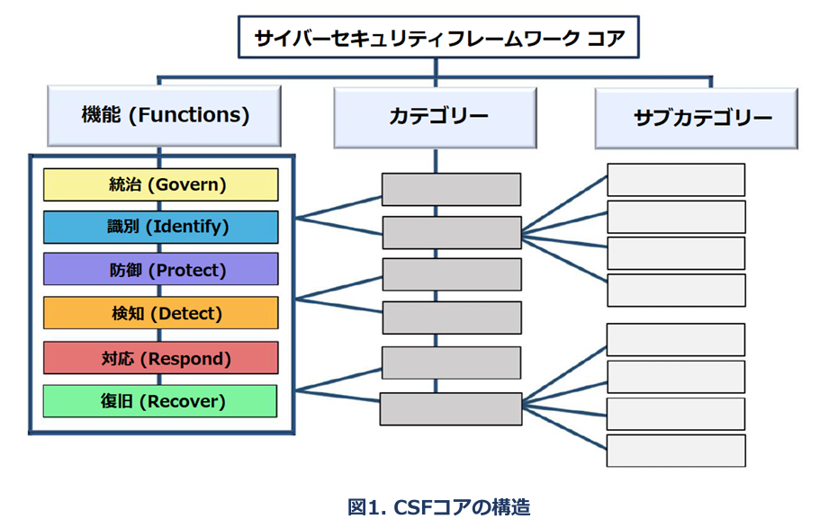
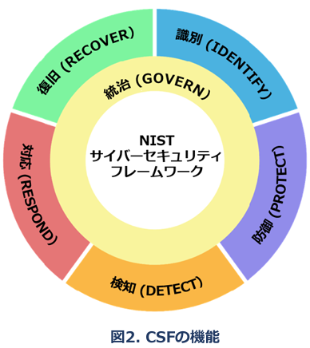
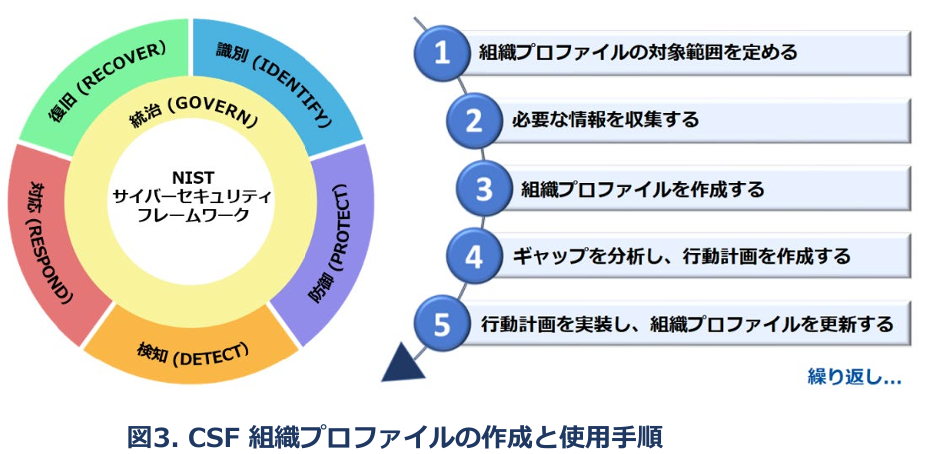
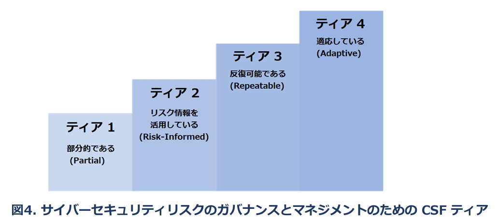
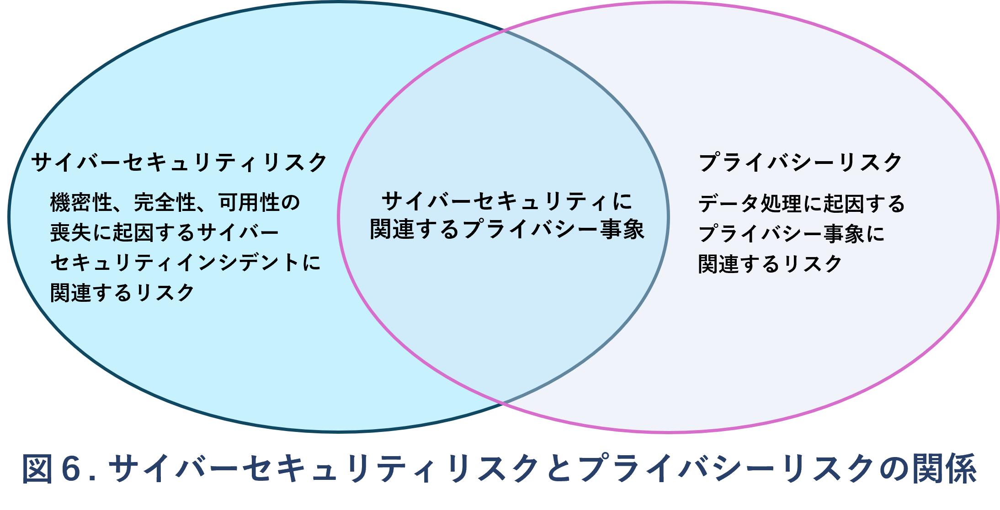
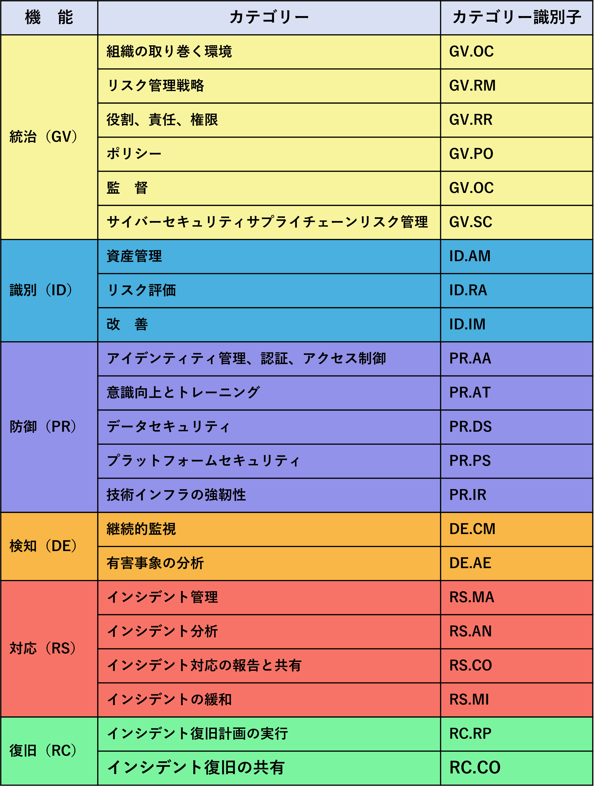

### 概 要 
米国国立標準技術研究所（NIST）のサイバーセキュリティフレームワーク（CSF）2.0は、産業界、政府機関、その他の組織におけるサイバーセキュリティリスクの管理に向けた指針として策定されたものである。本フレームワークは、組織の規模、分野、成熟度を問わず、あらゆる組織がサイバーセキュリティへの取り組みを理解・評価し、優先順位を付けて共有するために使用する。サイバーセキュリティにおける目指すべき状態（成果）を、高度な観点から体系的に分類したものである。CSFは、各成果をどのように達成すべきかを規定するものではない。代わりに、その達成に資するプラクティスや管理策について、オンライン補足資料を通じて関連情報を示している。本書では、CSF 2.0の構成要素とその全体像、および多様な活用方法について述べる。

### キーワード 
サイバーセキュリティ、
サイバーセキュリティフレームワーク（CSF）、
サイバーセキュリティリスクガバナンス、
サイバーセキュリティリスク管理、
事業体リスクマネジメント、
プロファイル、
ティア

### 対象者 
CSFの主な対象は、サイバーセキュリティプログラムの策定および推進を担う個人である。加えて、経営幹部、取締役、調達担当者、技術者、リスク管理者、法務担当者、人事担当者、サイバーセキュリティおよびリスク管理の監査人など、リスク管理に関与するその他の関係者も、サイバーセキュリティに関する意思決定を行う上での指針としてCSFを活用できる。さらに、サイバーセキュリティリスク管理の優先事項を策定し、周知する立場にある政策立案者やその影響力を持つ者（例：業界団体、専門機関、規制当局）にとっても、CSFは有用な枠組みとなるであろう。

### 補足コンテンツ 
NIST は、クイックスタートガイドやコミュニティプロファイルを含む、CSF実装を支援する補足資料の整備と公開を今後も継続する。これらの補足資料はすべて、NIST CSF公式ウェブサイト上で一般公開されている。同ウェブサイトで参照すべき補足資料に関する提案は、いつでも NIST（cyberframework@nist.gov）宛に送信することができる。

### 読者への注意 
特に断りのない限り、本書で引用、参照、抜粋された文書は、そのすべてが本書に組み込まれているわけではない。 バージョン 2.0 より前のサイバーセキュリティフレームワークは、「重要インフラのサイバーセキュリティを改善するためのフレームワーク（Framework for Improving Critical Infrastructure Cybersecurity）」 と呼ばれていたが、CSF 2.0 ではこの名称を使用していない。

### 謝辞 
CSF は、米国および世界中の業界、学界、政府機関が数年間にわたって協力して作成したものです。NIST は、この改訂版 CSF の作成に貢献したすべての方々に感謝の意を表します。CSF の作成プロセスに関する情報は、NIST CSF ウェブサイトをご覧ください。CSF の使用に関するご意見やご感想は、cyberframework@nist.gov までお寄せください。

## Table of Contents
## 目　次

### 1. Cybersecurity Framework (CSF) Overview
###    サイバーセキュリティフレームワークの概要

### 2. Introduction to the CSF Core  
###    ＣＳＦコアの導入

### 3. Introduction to CSF Profiles and Tiers  
###    ＣＳＦプロファイル・ＣＳＦティアの導入

### 4. Introduction to Online Resources That Supplement the CSF  
###    ＣＳＦを補足するオンライン資料の紹介 

### 5. Improving Cybersecurity Risk Communication and Integration  
###    サイバーセキュリティリスクの情報共有と統合の改善 

### 附属書 A CSFコア 
### 附属書 B CSFティア 
### 附属書 C 用語集

## 図の一覧

### 1. 図1 CSF のコア構造　3

### 2. 図2 CSF の機能　5

### 3. 図3 CSF 組織プロファイルの作成および使用の手順　6

### 4. 図4 サイバーセキュリティリスクのガバナンスおよび管理のための CSF の階層 8

### 5. 図5 CSF を使用したリスク管理コミュニケーションの改善　10

### 6. 図6 サイバーセキュリティとプライバシーのリスクの関係 　13

## 1. サイバーセキュリティフレームワーク（CSF）概要

この文書は、NIST サイバーセキュリティフレームワーク（フレームワークまたは CSF）のバージョン 2.0 である。以下の内容である。  

- CSF コアは、サイバーセキュリティリスクの特定、評価、対応を体系的に進めるための分類枠組であり、CSF 全体の中核をなす。コアは、機能（Functions）、カテゴリ（Categories）、サブカテゴリ（Subcategories）の三層構造で構成され、それぞれの層において具体的な成果目標や行動指針が定義されている。これらは経営層から実務担当者まで、専門知識の有無を問わず活用可能であり、業種・国・技術を問わず幅広い組織に適用できる柔軟性を持つ。
- CSF 組織プロファイルは、CSF コアに基づき、組織の現在のサイバーセキュリティ態勢や、将来的に目指すべき目標態勢を構造的に記述する枠組である。これにより、現状と目標とのギャップを明確にし、改善の方向性を示すことができる。
- CSF ティアは、組織のサイバーセキュリティにおけるリスクガバナンスおよび管理体制の成熟度を、4段階で示す評価基準である。ティアは、組織がリスクをどのように認識し、どの程度体系的に管理しているかを把握する手がかりを提供する。

この文書は、組織が目指すべき望ましい成果を提示するものであり、成果そのものやその達成手段を規定するものではない。成果を達成するための方法は、CSF を補完する一連のオンラインリソースにおいて説明されており、NIST CSF のウェブサイトから入手可能である。これらのリソースは、成果の実現に役立つ実践手法や管理策に関する追加の指針を提供し、CSF の理解、導入、運用を組織が効果的に行えるよう支援することを目的とする。具体的な補足リソースは以下の通りである。  

- 各成果に関連する既存の国際標準、ガイドライン、フレームワーク、規制、政策などを参照する参考資料  
- 各成果を達成するために活用可能な具体的手法を示す実施例
- CSF とそのオンラインリソースの活用方法を解説し、旧バージョンからバージョン2.0への移行も支援するクイックスタートガイド
- CSF の適用とサイバーセキュリティリスク管理の優先順位設定を支援するコミュニティプロファイルおよび組織プロファイルテンプレート  組織は、CSF コア、プロファイル、ティアをこれらの補足リソースと組み合わせて用いることで、以下の活動を体系的に実施できる

- 理解と評価：組織全体または一部における現在の、あるいは目標とするサイバーセキュリティ態勢を記述し、リスクとのギャップを明確化し、解消に向けた進捗状況を継続的に評価する  
- 優先順位付け：組織の使命、法的・規制上の要件、リスク管理方針およびガバナンスの基準に整合させながら、リスク対応策を特定し、実行の優先度を決定する  
- 情報共有：サイバーセキュリティ上のリスク、能力、ニーズ、対応方針について、組織内外の関係者と共通言語で明確に情報を共有する

CSF は、組織のサイバーセキュリティプログラムの成熟度にかかわらず、産業界、政府機関、学術機関、非営利団体など、あらゆる規模と分野の組織に適用可能な構造となっている。CSF は、自主的に導入できると同時に、政府の政策や法的要請に基づいて採用される中核的なリソースでもある。その分類体系および参照資料は国際的に中立であり、過去のバージョンは米国内外の多数の政府および組織において、サイバーセキュリティ戦略の策定や自己評価フレームワークとして実績ある形で活用されてきた。  

CSF は、他のフレームワーク、国際標準、業界ガイドライン、先進的な実践例と併用することで、サイバーセキュリティリスクの管理体制を強化し、企業全体における情報通信技術（ICT）リスクの特定・評価・対応の基盤を構築する。CSF は、規模や業種を問わず各組織の状況に応じて柔軟に調整できる構造を持つ。組織には、それぞれ異なる脅威環境、脆弱性、リスク許容度、業務目標および制約条件が存在するため、CSF の実装方法やリスク対応の方針は各組織ごとに異なる形で構築される必要がある。  

この文書の残りの部分は、以下の構成で構成されている：  
- 第2章では、CSF コアの基本要素である「機能（Functions）」「カテゴリ（Categories）」「サブカテゴリ（Subcategories）」について説明する。  
- 第3章では、CSF プロファイルおよびティアの概念とその役割を定義する。  
- 第4章では、CSF に関連するオンラインリソーススイートの主要なコンポーネントについて概要を示す。対象は、情報参照資料（Informative References）、実施例（Implementation Examples）、クイックスタートガイド（Quick-Start Guides）の3点である。
- 第5章では、CSF を他のリスク管理プログラムやフレームワークとどのように統合できるかについて解説する。
- 付録Aには、CSF コアの全体構造が含まれている。
- 付録Bでは、CSF ティアの構造と位置づけを示す概念図を掲載する。
- 付録Cには、CSF に関連する用語の定義をまとめた用語集が記載されている。
  - 参考情報（Informative References）  
　  各成果に関連する既存の国際的な基準、ガイドライン、フレームワーク、規制、政策などに基づく指針の出典
  - 実施例（Implementation Examples）  
　  各成果を達成することを目的とした、考えられる具体的な実装例
  - クイックスタートガイド（Quick-Start Guides）  
　  CSFおよびそのオンライン補足資料の活用方法について実用的な手引きを提供。従来のCSFバージョンから2.0への移行方法も含まれる。
  - コミュニティプロファイルおよび組織プロファイルテンプレート
　  CSFを実際の運用に適用する際、サイバーセキュリティリスクの管理における優先事項の整理時の支援ツールとして活用できる。組織はCSFコア、プロファイル、ティアをこれらの補足資料と組み合わせて用いることで、サイバーセキュリティリスクの理解、評価、優先順位付け、関係者との共有といった一連の取り組みを行うことができる。
  - 理解と評価（Understand and Assess）：
    組織の一部または全体における現在または目指すべきサイバーセキュリティ態勢を把握することでそこに存在するギャップ（不足や課題）を明らかにし、それらの是正に向けた取り組みの進捗状況を評価

## 2. CSFコアの概要
付録Aは、CSFコアを「機能 → カテゴリ → サブカテゴリ」の順に整理した、サイバーセキュリティの目指すべき状態（成果）のセットを表している（図1参照）。
これらの成果は、実行すべき行動のチェックリストではない。具体的な取り組みは、組織やユースケースによって異なり、それを実行する担当者もまた異なる。また、機能・カテゴリ・サブカテゴリの順序や数は、それぞれの実施順や重要度を示すものではない。
CSFコアの構造は、組織内でリスク管理の実行に責任を持つ人々にとって、理解しやすく、かつ実践しやすいものとなるよう設計されている。

CSFコアの機能（統治、識別、防御、検知、対応、復旧）とは、サイバーセキュリティの目指すべき状態（成果）を最上位の観点から分類したものである。

- GOVERN（ガバナンス）
組織のサイバーセキュリティリスクに関する戦略、方針、目標水準が策定・共有され、監視されている状態である。
この機能は、ミッションや利害関係者の要請を踏まえて他の5つの機能の成果を達成・優先するための指針を提供する。
GOVERNには、組織の状況把握、戦略やサプライチェーンリスク管理の策定、責任や権限の明確化、ポリシー策定、戦略の監督などが含まれる。
また、サイバーセキュリティを組織全体のエンタープライズリスク管理（ERM）に統合する上でも重要な役割を担う。  

- IDENTIFY（識別）
組織がどのような資産（データ、ハードウェア、ソフトウェア、システム、施設、サービス、人など）やサプライヤー、関連するリスクを把握する機能である。
GOVERNで定めた方針やミッションに沿って、サイバーセキュリティ対策の優先順位を決定する。併せてリスク管理に関係するポリシーや計画、プロセスの改善点を特定する。これにより６つの機能全てにおける対応の基盤を形成する。

- PROTECT（防御）
特定・優先順位付けされた資産やリスクに対し、適切な防御策を講じる機能である。
サイバー攻撃の発生や影響を抑えるだけでなく、新たな取り組みや技術を安全に導入する基盤となる。
この機能の成果には以下が含まれる：
  - ID・認証・アクセス管理
  - セキュリティ教育とトレーニング
  - データの保護
  - プラットフォーム（ハードウェア／ソフトウェア／サービス）の防御
  - 技術インフラの回復力の強化

- DETECT（検知）
攻撃や侵害の兆候を迅速に発見・分析する機能である。
異常やインシデントの初期兆候（IOC）を把握することで、的確な対応や復旧を可能にする。

- RESPOND（対応）
検知されたインシデントに対し、影響を抑える行動を取る機能である。
具体的な成果は、インシデント管理、分析、緩和、報告、関係者との連携・情報共有が含まれる。

- RECOVER（復旧）
インシデントで影響を受けた資産や業務を迅速に正常な状態へ復旧させる機能である。
復旧中に必要な情報共有だけでなく、業務再開までの円滑な調整も含まれる。

---

サイバーセキュリティ対策は、単に悪影響を回避するだけでなく、新たなビジネスチャンスの創出にもつながる。
たとえば、自社施設の空きスペースをホスティング事業者に提供し、その後、金融システムを自社内のデータセンターから移行することで、コスト削減とセキュリティリスク軽減を同時に実現するといった事例もある。

---

  
図2：CSF機能の関係性（車輪構造）  
図2では、CSFの各機能が相互に関係していることを表現するため、「車輪（ホイール）」の形で表現している。  

たとえば、IDENTIFY で資産を把握し、PROTECT でその資産を守る。
GOVERN や IDENTIFY における計画やテストへの投資は、DETECT による早期検知や、RESPOND／RECOVER における迅速な対応・復旧を支える。
GOVERNは他の5つの機能の実施方針に影響の与えるため、車輪の中心に配置されている。  

各機能は、その内容を表す動詞を名付けられており、複数のカテゴリで構成されている。カテゴリは関連する成果をまとめたもので、さらに技術的・管理的な活動に関する具体的な成果としてサブカテゴリへと細分化される。サブカテゴリは網羅的ではないが、各カテゴリの目的を達成するための詳細な内容を表している。  

機能、カテゴリ、サブカテゴリは、組織が活用するあらゆるICT（情報技術［IT］、モノのインターネット［IoT］、オペレーショナルテクノロジー［OT］を含む）に適用される。また、クラウド、モバイル、人工知能など、あらゆる技術環境にも対応している。CSFコアは将来を見据えて設計されており、技術や環境の変化に柔軟に適応できるものとなっている。

## 3. CSFプロファイルとティアの概要
このセクションでは、CSFプロファイルとティアの概念を定義する。

### 3.1 CSFプロファイル
CSF組織プロファイルは、CSFコアの目指すべき状態（成果）に基づき、組織の現在または目標とするサイバーセキュリティ態勢を記述する枠組みである。プロファイルは、組織のミッション、利害関係者の目標水準、脅威動向、関連要件などを踏まえて、CSFコアの目指すべき状態（成果）を理解、調整・評価・優先順位付けされ、関係者間での共有に用いられる。これにより、組織は達成すべき成果を明確にし、優先順位を付けた上で関係者とその内容を共有することができる。

各組織プロファイルには、以下のいずれか、あるいは両方が含まれる。

1. 現状プロファイル
　現時点で組織が達成している成果、または達成を目指している目標を明示し、それぞれの成果・目標がどのように、あるいはどの程度達成されているかを明らかにする。

2. 目標プロファイル
　組織がサイバーセキュリティリスク管理の目的達成に向けて選定・優先付けした目標である。将来的なセキュリティ態勢の変化（新たな要件や技術導入、脅威インテリジェンスの変化など）を見据えて策定される。

---

コミュニティプロファイルは、複数の組織に共通する関心や目標に対応するための成果の基準である。通常は、特定の業種・業界、技術領域、脅威の種類、その他の用途に応じて開発される。各組織は、これを自組織の目標プロファイルの土台として利用することができる。具体例は、NIST CSFの公式ウェブサイトで公開されている。

---

図3及び以下の手順は、組織がプロファイルを活用してサイバーセキュリティ態勢を継続的に改善する一例である。  

1 組織プロファイルの概要を把握する  
2 必要な情報を収集する  
3 組織プロファイル（現状プロファイル・目標プロファイル）を作成する  
4 ギャップを分析し、計画を作成する  
5 計画を実施し、プロファイルを更新する  

繰り返し...

#### プロファイルの作成手順
 1. 組織プロファイルの範囲を定義する  
プロファイルの対象範囲を定めるため、その前提となる要件や仮定を文書化する。組織は必要に応じて複数のプロファイルを作成し、それぞれ異なる範囲を持たせることができる。例えば、組織全体を対象とするプロファイル、組織の財務システムに限定したプロファイル、またはその財務システムに関連するランサムウェア脅威への対応とランサムウェアインシデントの対応に限定したプロファイルを作成することも可能である。  

2. 必要情報の収集  
組織のポリシー、リスク管理の優先事項やリソース、エンタープライズリスクプロファイル、ビジネスインパクト分析（BIA）、適用しているセキュリティ要件・基準、手順・対策に使用する実務ツール類、関係する職務上の役割などの職務情報が含まれる。

3. 組織プロファイルを作成する  
対象とするCSF成果に対し、必要な情報の種類を決定し文書化する。現状プロファイルが示すリスクを踏まえ、目標プロファイルの計画や優先順位付けに反映させる。必要に応じて、コミュニティプロファイルを目標プロファイルの土台として活用することもできる。  

4. ギャップ分析と計画の策定  
現状プロファイルと目標プロファイルの差異ギャップを特定する。その結果に基づき、優先順位を付けた計画（例：リスク登録簿、リスク詳細報告書、アクションプランとマイルストーン[POA&M]等を含む）を策定する。  

5. 計画の実行とプロファイルの更新  
計画に従い改善を進め、目標プロファイルに向けて態勢を発展させていく。計画は期限を設定することも継続的な取り組みとすることも可能である。  

継続的な改善の観点から、これらのステップは必要に応じて繰り返し実施することが推奨される。  

**プロファイルの活用例 : 外部関係者との情報共有での有用性**  
CSFプロファイルは、内部のリスク管理だけでなく、外部関係者との情報共有にも有用である。例えば、現状プロファイルはビジネスパートナーや見込み顧客に対し、自組織のセキュリティ体制や現状の能力、改善の方向性を示す資料として活用できる。一方、目標プロファイルは、取引先やサプライヤーに対し自組織が求めるセキュリティ要件や目標とする達成レベルを明確に伝える手段として機能する。これにより、関係者間でのセキュリティに関する共通理解が促進され、信頼性の向上やリスク低減にも寄与することができる。  

### 3.2. CSF ティア
ティアとは組織のサイバーセキュリティリスクの管理・統制体制の成熟度を示すものである。現在・目標プロファイルを策定する際に使用する概念であり、ティアを活用することで、組織がリスクをどのように捉え、どのような管理体制を構築しているかを評価する際の考慮事項や位置付けが明確となる。  
図4及び付録Bに示されているように、ティアは次の４段階で構成されている。  
ティア１（部分的）：対応は場当たり的かつ非公式で、明確なリスク管理プロセスが確立されていない状態  
ティア２（リスク情報に基づく）：基本的なプロセスが存在し、リスク情報を活用した意思決定が行われている。  
ティア３（反復可能）：標準化されたプロセスが確立され、継続的に適用されている。  
ティア４（適応している）：組織全体がアジャイルかつリスクに応じた高度な管理を実施し、継続的に改善されている。  

ティアの選定により、組織のリスク管理の方針や水準が明確となり、全体的な方向性を定めることができる。  

なおティアは、既存の組織のサイバーセキュリティリスク管理手法を補完するものであって、代替するものではない。例えば、組織全体のサイバーセキュリティリスク管理アプローチのベンチマークとして内部での共通認識の形成に活用できる。また、リスク状況や外部要件に応じて組織がセキュリティ管理体制を見直す際の基準にもなる。そのため、リスクの増大や法的要件の強化、費用対効果の分析結果により、より高いティアへの移行の判断基準になることもある。  

NIST CSF 公式サイトでは、プロファイル及びティアの実装に関する補足資料、プロファイルテンプレート、コミュニティプロファイルのレポジトリなどを提供している。これらは人にも機械にも利用可能な形式で整備されている。  

## 4. CSFを補完するオンライン補足資料の紹介
NIST等は、CSFの理解・適応・活用を支援するためのオンライン補足資料群を提供している。これはウェブ上で公開されており、安定的で更新頻度が少ないこの文書よりも頻繁に更新可能であり、機械可読形式でも提供される。  
このセクションでは、次の3種（情報参照（Informative References）、実装例（Implementation Examples）、クイックスタートガイド（Quick Start Guides））のオンライン補足資料について概要を説明する。  

**情報参照（Informative References）**  
情報参照は、CSFコアと各種の規格、ガイドライン、規制、その他の文書との対応関係を示すものである。これにより、組織がどのようにして目標とする成果を達成できるかを検討する手がかりとなる。  
情報参照は、業種別または技術分野別に特化しているものもあり、NISTだけでなく他の組織によっても作成されている。一部の情報参照はサブカテゴリよりも限定的な範囲を対象とするものもある。たとえば、NIST SP 800-53の特定の管理策は、あるサブカテゴリの目指すべき目標（成果）達成に必要な複数の要素の一つである。一方で、複数のサブカテゴリにまたがる高次の要件を示す情報参照も存在する。  
組織は、CSFを自身にとって最も関連性の高い情報参照を選択・活用することができる。  

**実装例（Implementation Examples）**  
実装例は、サブカテゴリの成果を達成するための簡潔かつ実践的な手順の例示である。使用される動詞には「共有する」「文書化する」「開発する」「実施する」「監視する」「分析する」「評価する」「演習する」などが含まれる。  
これらはあくまで参考例である。組織が実施すべき行動を網羅したものでも、リスク対応の基準として規定されたものでもないことは忘れないでほしい。  

**クイックスタートガイド（Quick Start Guides, QSG）**  
クイックスタートガイドは、特定のCSFトピックに焦点を当て短く要点を押さえたドキュメントである。読者によってはこちらの方が理解が容易であろう。QSGはCSFの最重要部分を抜き出して「最初の一歩」となる行動指針を提示することで、組織が実施するサイバーセキュリティ態勢の強化や組織に関連するリスク管理の導入支援を行うものである。各QSGは個別に更新され、必要に応じて新たなガイドが追加される。  

CSF 2.0に関連する新しい情報参照の提案は、NISTの olir@nist.gov へ送付できる。また、QSGの新テーマを含むCSF公式ウェブサイトで紹介すべき他のリソースの提案は、cyberframework@nist.gov まで連絡してほしい。

## 5. サイバーセキュリティリスクの共有※1と統合※2の改善
CSFの活用方法は、組織のミッションやリスクの特性によって異なる。GOVERNで述べられるように、利害関係者の求める目標水準やリスク選好度※3・許容度を踏まえることで、組織はサイバーセキュリティに関する活動の優先順位を定め、経費や対応に関する判断を行える。

組織はリスクの発生確率や影響度に応じて、負のリスク（損失につながるリスク）には、軽減、移転、回避、受容といった対応策を選択できる。
一方で、正のリスク（機会につながるリスク）には実現、共有、強化、受容といった選択肢から対応方法を選ぶことができる。

CSFは、内部ではサイバーセキュリティ能力の整備や運用のために、外部では第三者の管理や対話の土台として活用できる。

活用の形にかかわらず、CSFを指針として用いることで、組織はサイバーセキュリティリスクとその対策の理解・評価・優先順位付け・共有をより効果的に行えうことができる。また組織が重視し選択した「目指すべき目標・成果」群は、組織のリソースや優先事項を考慮することで、サイバーセキュリティ態勢の強化や、ミッション遂行に不可欠な機能の維持に向けた戦略的意思決定の指針として活用できる。

※1 内部・外部の関係者との情報共有  
※2 他の組織活動や経営判断との統合  
※3 どれぐらいのリスクを「進んで」取るか  

### 5.1. リスク管理の情報共有の改善
CSFは、サイバーセキュリティに求められる目標水準、計画、リソースに関する情報共有を改善する基盤となる。
図5の上半分に示されるように、CSFは、組織全体の戦略や優先事項を判断する経営層と、具体的なリスクを管理する管理層との間に双方向の情報の流れを形成する。また、図の下半分に示されるように、管理層と、技術の実装・運用を担う実務者との間でも同様の情報共有を支援する。

図の左側は、実務者からの更新情報、現場の洞察、懸念事項を上層部に適切に伝えることの重要性を示している。CSFはこのような組織内のリスクの情報共有構造を確立する枠組みでもある。

CSFの導入準備では、まず経営層から組織の優先事項、リソース、リスクに関する方向性を把握する。そのうえで、管理者が実務者と連携し、ビジネス要件を共有しながらリスクに基づく組織プロファイルを作成する。現状プロファイルと目標プロファイルの間に見つかったギャップは、管理者と実務者によって対処され、その内容はシステム単位の計画に反映される。
システムレベルでのコントロールや監視の適用によって、組織全体で目標状態が実現されると、その成果はリスクレジスター※4や進捗報告として共有される。継続的な評価を通じて、管理者は起こり得る損失を抑え、期待される効果を高めるための判断基準を得ることができる。

GOVERN機能は、経営層とのリスク共有を支える基盤である。経営層の議論では、戦略や不確実性が組織目標の達成に及ぼす影響について検討される。こうしたガバナンスに関する対話を通じて、リスク対応戦略（サプライチェーンを含む）、役割や権限、ポリシー、監督体制に関する共通認識が築かれていく。経営層は組織のニーズに基づきサイバーセキュリティの優先事項と目標を策定し、リスク許容度や責任の所在、リソース配分に関する方針や要件を明確に伝える。  

また、サイバーセキュリティ管理とERM（Enterprise Risk Management）および部門レベルのリスク管理との統合も担っている。これにより、図5上部に示されるように、これらの情報共有にはERMや部門レベルのリスク管理に関する考慮事項が含まれ、管理職や実務者へ展開される。

経営層が策定したサイバーセキュリティの全体目標は、管理者へ共有され、さらに各部門へと展開される。商業企業においては、これらの目標は事業部門や業務部門に適用され、政府機関では、部局や支部レベルでの対応が求められることもある。CSFを実装するにあたり、管理者は、目標プロファイルに示されたリスク目標の達成に向けて、共通サービス、セキュリティ統制、部門間の連携をどう活用するかに注力する。この取り組みは、リスク登録簿、リスク詳細報告書、POA&M（是正措置計画）といった行動計画を通じて継続的に改善・管理される。

実務者は、目標とするセキュリティ状態の実現と運用上のリスク変化の測定に注力し、サイバーセキュリティ対策の計画、実施、監視を担う。リスクを許容可能な水準に抑えるためのコントロールが導入される中で、実務者は主要業績評価指標（KPI）や主要リスク指標（KRI）などの情報を通じて、マネージャーや経営幹部に組織のセキュリティ状況を伝達する。経営層はこの情報を、他の種類のリスク情報と統合し、自組織のリスク戦略を維持・見直すための意思決定に役立てる。こうしたプロセスの繰り返すなかで、方針と優先事項が更新され、組織プロファイルの更新に反映される。

### 5.2 他のリスク管理プログラムとの連携の強化
すべての組織はICTに関連する多様なリスク（プライバシー、サプライチェーン、AIなど）を抱えており、それぞれに特化したフレームワークやツールを活用することがある。ERMを通じて全体的な統合を図る組織もあれば、個別対応によって各リスクに注力する組織も存在する。規模の小さな組織では、リスク管理はエンタープライズ単位で行われ、大規模組織ではERMに統合された個別プログラムが併存することが多い。

経営層は、CSFの実施によって得られた結果を踏まえ、組織の統治体制やリスク戦略を適宜見直す。CSFは、サイバーセキュリティの専門的な概念を、経営層にも理解しやすいリスクマネジメントの言葉に置き換えるための橋渡しとして機能する。

以下のNIST資料は、CSFとERMの連携を説明する：

- NIST CSF 2.0 Enterprise Risk Management Quick-Start Guide
- NIST IR 8286: ERMとサイバーセキュリティの統合
- IR 8286A: サイバーリスクの特定と定量化
- IR 8286B: サイバーリスクの優先順位付け
- IR 8286C: サイバーリスクの段階評価
- IR 8286D: ビジネス影響分析によるリスク対応戦略
- SP 800-221：情報通信技術（ICT）リスクの企業への影響：企業リスクポートフォリオにおけるICTリスクプログラムの統治と管理
- SP 800-221A：情報通信技術（ICT）リスクの成果 
― ICTリスク管理プログラムと企業リスクポートフォリオの統合

CSFは、サイバーセキュリティリスク管理を個別のICTリスク管理プログラムと統合する際にも有効である。以下にその具体例を示す。

- サイバーセキュリティリスク管理と評価  
CSF は、既存のリスク管理および評価プログラムと組み合わせて活用するかとができる。たとえば、SP 800-37「情報システムおよび組織のためのリスク管理フレームワーク」や、SP 800-30「リスク評価の実施ガイド（NIST RMF）」などがある。NIST RMFおよび関連文書を採用している組織では、CSF を用いることで、SP 800-53「情報システムおよび組織のためのセキュリティとプライバシー管理策」からコントロールを選定し優先付けするRMFのアプローチを補完できる。

- プライバシーリスク
サイバーセキュリティとプライバシーは本来独立した分野だが、ある状況では両者の目的が重複する。図6はその関係性を示している。  
サイバーセキュリティリスク管理は、個人データの機密性・完全性・可用性の喪失に起因するプライバシーリスクへの対応において不可欠である。たとえば、データ漏洩は個人情報の盗用やなりすましなどを引き起こす可能性がある。ただし、プライバシーリスクは必ずしもサイバーセキュリティ上のインシデントに限らず、それ以外の要因からも発生し得る。  
組織はミッションや事業目的の達成のために個人データを処理する。その過程で、処理のあり方によって個人に不利益が及ぶプライバシー上の事象（プライバシーイベント）が発生する場合がある。こうした不利益はさまざまな形で現れるが、NISTはそれらを、「尊厳に関わる影響（例：恥ずかしさやスティグマ）」から「実質的な損害（例：差別、経済的損失、身体的被害）」に至るまでの幅広い影響として定義している。
NISTのプライバシーフレームワークとサイバーセキュリティフレームワーク（CSF）は、それぞれ異なる側面のリスクに対応するために併用可能である。また、NISTのプライバシーリスク評価手法（PRAM）には、プライバシーリスク評価に使用できる典型的な問題例のカタログが用意されている。  

- サプライチェーンリスク  
CSFは、組織がサプライチェーン全体におけるサイバーセキュリティリスクを可視化・管理し、関係者とのリスクに関する情報共有の強化に活用できる。あらゆる種類の技術は、地理的に分散し、複雑かつ多層的に委託されたグローバルなサプライチェーンエコシステムに依存している。このエコシステムには、購入者、サプライヤー、開発者、システムインテグレーター、外部システムサービス提供者など、技術に関わる多数の公的・民間の関係する個人や組織が関与し、製品やサービスの研究、開発、設計、製造、取得、提供、統合、運用、保守、廃棄、その他の利用や管理の各工程で相互に連携している。これらの関係は単に技術的な要素だけでなく、法制度、ポリシー、手続き、慣行などの影響も受けている。  

このような複雑で相互依存的な構造にあることから、サプライチェーンリスク管理（SCRM）は組織にとって極めて重要である。特にサイバーセキュリティに特化したSCRM（C-SCRM）は、サプライチェーン全体にわたるリスクへの対応策・戦略・ポリシー・手順を整備・実装する体系的なプロセスとなっている。  
CSFのC-SCRMカテゴリ [GV.SC] に含まれるサブカテゴリは、従来のサイバーセキュリティの成果とC-SCRMに特化した成果との橋渡しとなる。また、NISTの SP 800-161 Rev.1『システムおよび組織のためのサイバーセキュリティ・サプライチェーンリスク管理実践』 では、この分野に関する詳細な指針を示している。  

- 新興技術に起因するリスク  
新たな技術やその応用技術の登場により、新種のリスクも明らかになってきている。近年の代表例が人工知能（AI）であり、これはサイバーセキュリティリスクやプライバシーリスクに加え、財務リスク、評判リスクなどの多様なリスクを伴う。
これらのリスクに対応するために、NISTは人工知能リスク管理フレームワーク（AI RMF）を策定した。
AIに関するリスクを、他の企業リスク（財務、サイバーセキュリティ、プライバシー、評判など）と一体的に取り扱うことで、より統合された対応と組織運営の効率化が実現できる。
サイバーセキュリティおよびプライバシーのリスク管理に関する考慮事項や手法は、AIシステムの設計・開発・導入・評価・運用の各段階に適用可能である。
AI RMFの「コア」では、機能、カテゴリ、サブカテゴリという構造を用いて、AIの成果とそれに伴うリスク管理の方法を整理している。

## 附属書 A. CSFコア
この付録では、CSF コアの機能、カテゴリ、およびサブカテゴリについて説明する。表 1 には、CSF 2.0 コアの機能およびカテゴリ名、およびユニークなアルファベット識別子が記載されている。表内の各機能名は、付録内の該当する部分にリンクされている。コアの機能、カテゴリ、およびサブカテゴリの順序はアルファベット順ではない。これは組織内でリスク管理を実践する責任者が理解しやすい順序となっている。  

CSF コア、参考資料、実装例については、CSF 2.0 ウェブサイトおよび CSF 2.0 リファレンスツールから参照できる。このツールを使用すると、人間および機械が読み取り可能な形式でエクスポートできる。CSF 2.0 コアは、CSF 1.1 と同様のレガシー形式でも利用できる。  

### ガバナンス (GV): 組織のサイバーセキュリティリスク管理戦略、目標水準、およびポリシーが確立され、共有され、監視されている。

- **組織のコンテキスト (GV.OC)**: 組織のサイバーセキュリティリスク管理の決定を取り巻く状況 (使命、利害関係者の要求、依存関係、および法的、規制、契約上の要件) が理解されている。
  - GV.OC-01: 組織のミッションが理解され、サイバーセキュリティリスク管理に反映されている。  
  - GV.OC-02: 内部および外部の利害関係者が理解され、サイバーセキュリティリスク管理に関する彼らのニーズと要求が理解され、考慮されている。  
  - GV.OC-03: サイバーセキュリティに関する法的、規制、契約上の要件（プライバシーと市民の自由に関する義務を含む）が理解され、管理されている。
  - GV.OC-04: 外部利害関係者が組織に依存または期待する重要な目標、能力、およびサービスが理解され、共有されている。
  - GV.OC-05: 組織が依存する成果、能力、およびサービスが理解され、共有されている。

- **リスク管理戦略 (GV.RM)**：組織の優先事項、制約、リスク許容およびリスク選好に関する声明、および仮定が確立され、共有され、業務上のリスクに関する意思決定の支援に利用される。
  - GV.RM-01: リスク管理の目標が確立され、組織の利害関係者に合意されている。
  - GV.RM-02: リスク許容度およびリスク選好度の声明が確立され、共有され、維持されている。
  - GV.RM-03: サイバーセキュリティリスク管理活動およびその結果が、企業リスク管理プロセスに含まれている。
  - GV.RM-04: 適切なリスク対応オプションを説明する戦略的方向性が確立され、共有されている。
  - GV.RM-05: サイバーセキュリティリスク（サプライヤーやその他の第三者からのリスクを含む）に関する組織内の情報共有ラインが確立されている。  
  - GV.RM-06: サイバーセキュリティリスクの予測、文書化、分類、優先順位付けの標準化された方法が確立され、共有されている。  
  - GV.RM-07: 戦略的機会（すなわち、ポジティブなリスク）が明確化され、組織のサイバーセキュリティリスクの議論に組み込まれている。

- **役割、責任、および権限 (GV.RR)**: 説明責任、実績評価、および継続的な改善を促進するためのサイバーセキュリティの役割、責任、および権限が確立され、共有されている。  
  - GV.RR-01: 組織の管理職は、サイバーセキュリティリスクについて責任と説明責任を負い、リスクを認識し、倫理的で、継続的に改善する文化を醸成されている。
  - GV.RR-02: サイバーセキュリティリスク管理に関連する役割、責任、権限が確立され、共有され、理解され、実施されている。 
  - GV.RR-03: サイバーセキュリティリスク戦略、役割、責任、およびポリシーに相当する十分なリソースが割り当てられている 
  - GV.RR-04: サイバーセキュリティが人事管理に組み込まれている

- **ポリシー (GV.PO)**: 組織のサイバーセキュリティポリシーが策定され、共有され、実施されている。 
  - GV.PO-01: 組織の状況、サイバーセキュリティ戦略、優先事項に基づいて、サイバーセキュリティリスクを管理するためのポリシーが策定され、共有され、実施されている。 
  - GV.PO-02: 要件、脅威、技術、組織の使命の変化を反映するために、サイバーセキュリティリスクを管理するためのポリシーがレビュー、更新、共有、実施されている。

- **監督 (GV.OV)**: 組織全体のサイバーセキュリティリスク管理活動およびパフォーマンスの結果は、リスク管理戦略の情報提供、改善、調整に活用される 
  - GV.OV-01: サイバーセキュリティリスク管理戦略の結果をレビューし、戦略と方向性を情報提供し、調整する 
  - GV.OV-02: サイバーセキュリティリスク管理戦略をレビューし、組織の要件とリスクを確実にカバーするように調整する 
  - GV.OV-03: 組織のサイバーセキュリティリスク管理の成果を評価し、必要な調整についてレビューする

- **サイバーセキュリティサプライチェーンリスク管理 (GV.SC)**：サイバーサプライチェーンリスク管理プロセスが、組織の利害関係者によって特定、確立、管理、監視、および改善されている。 
  - GV.SC-01：サイバーセキュリティサプライチェーンリスク管理プログラム、戦略、目標、ポリシー、およびプロセスが確立され、組織の利害関係者によって合意されている。
  - GV.SC-02: サプライヤー、顧客、およびパートナーのサイバーセキュリティの役割と責任が確立され、社内外に共有され、調整されている。 
  - GV.SC-03: サイバーセキュリティサプライチェーンリスク管理が、サイバーセキュリティおよび企業リスク管理、リスク評価、および改善プロセスに統合されている。 
  - GV.SC-04: サプライヤーが特定され、重要度に応じて優先順位付けされている。
  - GV.SC-05: サプライチェーンにおけるサイバーセキュリティリスクに対応するための要件が確立され、優先順位付けされ、サプライヤーおよびその他の関連する第三者との契約やその他の合意に統合されている。 
  - GV.SC-06: 正式なサプライヤーまたはその他の第三者との関係を開始する前に、リスクを軽減するための計画とデューデリジェンスが実施されている 
  - GV.SC-07：サプライヤー、その製品およびサービス、およびその他の第三者がもたらすリスクは、関係の過程を通じて理解、記録、優先順位付け、評価、対応、および監視されている。
  - GV.SC-08：関連するサプライヤーおよびその他の第三者は、インシデントの計画、対応、および復旧活動に含まれている。
  - GV.SC-09: サプライチェーンのセキュリティ実装は、サイバーセキュリティおよび企業リスク管理プログラムに統合され、そのパフォーマンスは、技術製品およびサービスのライフサイクル全体を通じて監視される。  
  - GV.SC-10: サイバーセキュリティサプライチェーンリスク管理計画には、パートナーシップまたはサービス契約の終了後に実施される活動に関する規定が含まれる。

### 識別（ID）：組織の現在のサイバーセキュリティリスクが理解されている。
- **資産管理（ID.AM）**：組織が事業目的を達成するために必要な資産（データ、ハードウェア、ソフトウェア、システム、施設、サービス、人材など）を、組織の目標およびリスク戦略に対する相対的な重要度に応じて識別し、管理している。
  - AM-01：組織が管理するハードウェアの資産台帳が維持されている。
  - AM-02: 組織が管理するソフトウェア、サービス、システムの資産台帳が維持されている。 
  - AM-03: 組織の許可されたネットワーク通信および内部および外部ネットワークのデータフローが維持されている。
  - AM-04: サービスプロバイダーが提供するサービス一覧が維持されている。 
  - AM-05: 資産は、分類、重要度、リソース、およびミッションへの影響に基づいて優先順位付けされている 
  - AM-07: 指定データタイプに関するデータおよび対応するメタデータのリストが維持されている。
  - AM-08: システム、ハードウェア、ソフトウェア、サービス、およびデータは、そのライフサイクルを通じて管理されている

- **リスク評価 (ID.RA)**：組織、資産、および個人に対するサイバーセキュリティリスクが組織として理解されている。 
  - RA-01：資産の脆弱性が特定、検証、および記録されている。 
  - RA-02：情報共有フォーラムや情報源からサイバー脅威インテリジェンスを収集、受信している。 
  - RA-03：組織に対する内部および外部の脅威が特定、記録されている。
  - RA-04: 脆弱性を悪用する脅威の潜在的な影響と発生の可能性が特定され、記録されている。 
  - RA-05: 脅威、脆弱性、発生の可能性、および影響は、固有のリスクを理解し、リスク対応優先順位を決定するために使用されている。 
  - RA-06: リスク対応が選択され、優先順位付け、計画、追跡、および共有されている。
  - RA-07: 変更および例外は、管理され、リスクの影響について評価され、記録され、追跡される。 
  - RA-08: 脆弱性の開示を受け、分析し、対応するためのプロセスが確立されている。 
  - RA-09: ハードウェアおよびソフトウェアは、取得および使用前に、その信頼性および完全性が評価されている。 
  - RA-10: 重要なサプライヤーは、取得前に評価されている。

- **改善 (ID.IM)**: CSF 機能全体において、組織のサイバーセキュリティリスク管理プロセス、手順、および活動の改善点を特定する 
  - IM-01：評価から改善点を特定する。 
  - IM-02：サプライヤーや関連する第三者機関と協力して実施するセキュリティテストや演習から改善点を特定する。 
  - IM-03：運用プロセス、手順、および活動の実行から改善点を特定する。 
  - IM-04：運用に影響を与えるインシデント対応計画およびその他のサイバーセキュリティ計画を策定、共有、維持、および改善する。

### 保護 (PR): 組織のサイバーセキュリティリスクを管理するための保護手段を実装する。 
- **ID 管理、認証、およびアクセス制御 (PR.AA)**: 物理的および論理的資産へのアクセスは、許可されたユーザー、サービス、およびハードウェアに限定され、不正アクセスによるリスクの評価に応じて管理される。 
  - AA-01: 許可されたユーザー、サービス、およびハードウェアの ID および認証情報は、組織によって管理される。
  - AA-02: 識別情報は、接続・利用時の状況に応じて、認証情報と紐付けられ、確認される。
  - AA-03: ユーザー、サービス、およびハードウェアは認証されている 
  - AA-04: 識別情報のアサーション※5は、保護され、伝達され、検証される。
  - AA-05: アクセス権限、権限付与、および承認はポリシーで定義され、管理、実施、およびレビューされ、最小権限の原則と職務分離の原則が組み込まれている。 
  - AA-06: 資産への物理的アクセスは、リスクに応じて管理、監視、および制御されている。 

※5 ユーザーの認証状態や属性（氏名、役割、所属など）を他のシステムに伝える信頼可能な情報単位

- **意識向上とトレーニング（PR.AT）**：組織の従業員は、サイバーセキュリティに関する意識向上とトレーニングを受け、サイバーセキュリティに関連する業務を遂行できるようにする。
  - AT-01: 従業員は、サイバーセキュリティリスクを考慮した一般的な業務遂行に必要な知識とスキルを習得するための意識向上とトレーニングを受けている。 
  - AT-02: 専門的な役割を担う従業員は、サイバーセキュリティリスクを考慮した関連業務を遂行に必要な知識とスキルを習得するための意識向上とトレーニングを受けている。

- **データセキュリティ (PR.DS)**：データは、情報の機密性、完全性、および可用性を保護するために、組織のリスク戦略に従って管理される。
  - DS-01: 保存中のデータの機密性、完全性、可用性が保護されている 
  - DS-02: 転送中のデータの機密性、完全性、可用性が保護されている 
  - DS-10: 使用中のデータの機密性、完全性、可用性が保護されている 
  - DS-11: データのバックアップが作成、保護、維持、およびテストされている

- **プラットフォームセキュリティ (PR.PS)**：物理および仮想プラットフォームのハードウェア、ソフトウェア（ファームウェア、オペレーティングシステム、アプリケーションなど）、およびサービスは、その機密性、完全性、および可用性を保護するために、組織のリスク戦略に従って管理される。 
  - PS-01：構成管理の実践が確立され、適用されている。 
  - PS-02：ソフトウェアは、リスクに応じて維持、交換、および削除される。
  - PS-03: ハードウェアは、リスクに応じて維持、交換、および削除される。 
  - PS-04: ログ記録が生成され、継続的な監視のために利用可能にされている。 
  - PS-05: 許可されていないソフトウェアのインストールおよび実行が防止されている。 
  - PS-06: ソフトウェア開発ライフサイクルにセキュリティ確保の実践が組み込まれ、それらの実施状況はライフサイクル全体を通じて継続的に監視される。

- **テクノロジーインフラストラクチャのレジリエンス (PR.IR)**: セキュリティアーキテクチャは、資産の機密性、完全性、可用性、および組織のレジリエンスを保護するために、組織のリスク戦略に従って管理される。
  - IR-01: ネットワークおよび環境は、不正な論理的アクセスおよび使用から保護されている 
  - IR-02: 組織のテクノロジー資産は、環境上の脅威から保護されている 
  - IR-03: 通常時および異常時におけるレジリエンス要件を満たす仕組みが実装されている 
  - IR-04: 可用性を確保する十分なリソース容量が維持されている

### 検出（DE）：サイバーセキュリティ攻撃や侵害の可能性を発見し、分析する
- **継続的モニタリング（DE.CM）**：資産を継続的にモニタリングし、異常、IoC、その他の潜在的なリスク事象を検出する
  - CM-01：ネットワークおよびネットワークサービスをモニタリングして、潜在的なリスク事象を検出する
  - CM-02：物理的環境をモニタリングして、潜在的なリスク事象を検出する
  - CM-03：人員の活動および技術の利用状況をモニタリングして、潜在的なリスク事象を検出する
  - CM-06：外部サービスプロバイダーの活動および提供サービスをモニタリングして、潜在的なリスク事象を検出する
  - CM-09：コンピューティングハードウェア、ソフトウェア、実行環境、およびそれらに関連するデータをモニタリングして、潜在的なリスク事象を検出する

- **有害事象の分析（DE.AE）**:異常、IoC（侵害の指標）、その他の潜在的なリスク事象を分析し、それらの特性を明らかにして、サイバーセキュリティインシデントの検出につなげる。
  - AE-02：潜在的なリスク事象を分析し、それに関連する活動の理解を深める。
  - AE-03：複数の情報源から得られた情報を相関させる。
  - AE-04：リスク事象の影響範囲と想定される影響度を把握する。
  - AE-06：リスク事象に関する情報を、認可された担当者およびツールに提供する。
  - AE-07：サイバー脅威インテリジェンスやその他の状況を分析に統合する。
  - AE-08：リスク事象が定義されたインシデント基準を満たした場合には、インシデントとして正式に宣言する。

### 対応（RS）：検出されたサイバーセキュリティインシデントに対して、必要な対応措置を講じる。

- **インシデント管理（RS.MA）**：検出されたサイバーセキュリティインシデントへの対応を組織的に管理する。
  - RS.MA-01：インシデントが宣言された際には、関係する第三者と連携してインシデント対応計画を実行する。
  - RS.MA-02：インシデント報告を分類・選別し、内容を検証する。
  - RS.MA-03：インシデントを分類し、優先順位を付ける。
  - RS.MA-04：インシデントを、必要に応じてエスカレーションまたは上位対応に引き上げる。
  - RS.MA-05：インシデント復旧の開始に必要な基準を適用する。

- **インシデント分析 (RS.AN)**：インシデントに関する調査を通じて、フォレンジックおよび復旧活動を支援する。
  - RS.AN-03：インシデントの発生状況と根本原因を特定するための分析を実施する。 
  - RS.AN-06：調査中に実施された措置を記録し、その記録の完全性および出所を保持する。
  - RS.AN-07: インシデントのデータおよびメタデータを収集し、その完全性および出所を保持する。 
  - RS.AN-08: インシデントの規模を推定し、検証する。

- **インシデント対応報告およびコミュニケーション (RS.CO)**：法律、規制、またはポリシーの要求に応じて、組織内外の利害関係者と対応活動を調整する。 
  - RS.CO-02：組織内外の利害関係者にインシデントを通知する。 
  - RS.CO-03：指定された組織内外の利害関係者と情報を共有する。

- **インシデントの軽減（RS.MI）**：イベントの拡大を防ぎ、その影響を抑えるための活動を実施する。
  - RS.MI-01：インシデントを封じ込める。
  - RS.MI-02：インシデントを排除する。

### 復旧（RC）：サイバーセキュリティインシデントの影響を受けた資産および業務の運用を復元する。

- **インシデント復旧計画の実行（RC.RP）**：サイバーセキュリティインシデントによって影響を受けたシステムおよびサービスの運用可用性を確保するために、復旧活動を実施する。
  - RC.RP-01：インシデント対応プロセスにおいて開始指示が出され次第、対応計画の復旧フェーズを実行する。
  - RC.RP-02：復旧措置を選定し、適用範囲を定め、優先順位を付けたうえで実施する。
  - RC.RP-03：復旧に使用する前に、バックアップおよびその他の復旧資産の整合性を検証する。
  - RC.RP-04：重要なミッション機能およびサイバーセキュリティリスク管理の観点を考慮して、インシデント後の運用の基準を策定する。
  - RC.RP-05：復元された資産の整合性を検証し、システムおよびサービスを復旧し、通常の運用状態であることを確認する。
  - RC.RP-06：あらかじめ定めた基準に基づいて復旧の終了を宣言し、インシデント関連文書を作成・完結する。

- **インシデント復旧に関するコミュニケーション（RC.CO）**：復旧活動は、組織内外の関係者と連携して進められる。  
  - RC.CO-03：復旧活動および業務機能の回復状況について、指定された社内外の関係者に対して情報を共有する。
  - RC.CO-04：インシデント復旧に関する最新情報を、承認された手段と内容に基づいて対外的に発信する。

## 附属書 B.　CSFティア
表2は、セクション3で説明されたCSFティアの概念図の説明である。ティアは、組織におけるサイバーセキュリティリスクのガバナンス実践（GOVERN）およびリスク管理実践（IDENTIFY、PROTECT、DETECT、RESPOND、RECOVER）の成熟度を示すものである。  

表２. CSFティアの概念表

|ティア|サイバーセキュリティリスクガバナンス|サイバーセキュリティリスク管理 |
|---|---|---|
|Tier 1: 部分的である|組織のサイバーセキュリティリスク戦略の適用は、その場限りの対応で管理されている。 優先順位の設定も場当たり的で、組織の目標や脅威環境に正式に基づいたものではない|組織全体として、サイバーセキュリティリスクに対する認識は限定的である。 サイバーセキュリティリスクの管理は、不定期かつ個別の事案ごとに実施されている。 組織内でサイバーセキュリティに関する情報を共有するためのプロセスが整備されていない可能性がある。 また、組織は、自らが調達・利用している製品やサービス、およびそれらの提供元であるサプライヤーに関連するサイバーセキュリティリスクを、一般的に把握していない。|
|Tier 2: リスク情報に基づいている |リスク管理の実践は経営層により承認されているが、組織全体のポリシーとして定着しているわけではない。 サイバーセキュリティ活動および防御ニーズの優先順位は、組織のリスク目標、脅威環境、または事業・ミッション上の要件に基づき、直接的に判断されている。|組織全体としてサイバーセキュリティリスクに対する認識はあるものの、それらのリスクを管理するための全社的なアプローチは確立されていない。 組織目標や各種プログラムにおいてサイバーセキュリティが考慮されることもあるが、その考慮は組織内のあらゆるレベルで一貫して行われているわけではない。 組織内および外部資産に対するサイバーリスクの評価は実施されているが、通常は継続的かつ反復的に行われているものではない。 サイバーセキュリティに関する情報は、組織内で非公式に共有されている。 また、組織はサプライヤーや、取得・利用している製品およびサービスに関連するサイバーセキュリティリスクを把握しているものの、それらに対する対応は一貫性や正式性を欠いている。|
|Tier 3:  反復可能である|組織のリスク管理の実践は正式に承認され、方針として明文化されている。     リスク情報を考慮した方針、プロセス、および手順が定義され、意図したとおりに実施され、レビューされている。    組織のサイバーセキュリティの実践は、ビジネス/ミッションの要件、脅威、および技術的状況の変化に対してリスク管理プロセスを適用して、定期的に更新されている。|サイバーセキュリティリスクの管理については、組織全体でのアプローチが取られている。サイバーセキュリティ情報は、組織全体で定期的に共有されている。 リスクの変化に効果的に対応するための一貫した方法が導入されている。職員は、割り当てられた役割と責任を果たすための知識とスキルを持っている。     組織は、資産のサイバーセキュリティリスクを一貫して正確に監視している。サイバーセキュリティ担当幹部とサイバーセキュリティ担当以外の幹部は、サイバーセキュリティリスクについて定期的にコミュニケーションを取っている。経営陣は、組織内のすべての業務においてサイバーセキュリティが考慮されるようにしている。  組織のリスク戦略は、サプライヤーおよび取得・使用する製品・サービスに関連するサイバーセキュリティリスクを踏まえて策定されている。従業員は、基本要件を伝える書面による合意、ガバナンス構造（リスク委員会など）、ポリシーの実施と監視などのメカニズムを通じて、これらのリスクに対して正式に対応している。これらの対応は、意図したとおりに一貫して実施され、継続的に監視・レビューされている。|
|Tier 4:  適応している|組織全体で、リスク情報に基づくポリシー、プロセス、手順を活用し、潜在的なサイバーセキュリティ事象に対応する統一的なリスク管理アプローチが確立されている。 サイバーセキュリティリスクと組織の目標との関係性は明確に把握されており、意思決定の際に適切に考慮されている。 経営陣は、財務リスクやその他の組織リスクと同様の枠組みで、サイバーセキュリティリスクを継続的に監視している。 組織の予算編成は、現在および将来のリスク環境やリスク許容度に関する理解に基づいて行われている。 各事業部門は経営層のビジョンを実行に移すとともに、組織全体のリスク許容度を踏まえてシステムレベルのリスクを分析している。 サイバーセキュリティリスク管理は、組織文化に深く根付いている。 これは過去の取組に対する組織の継続的な学習と、システムやネットワーク上での活動に対する絶え間ない状況認識を通じて進化してきたものである。 組織は、事業やミッションの目標変更にも迅速かつ的確に対応できる柔軟性を備えており、その際のリスク対応および情報共有の手法についても適応的に見直すことができる。|組織は、過去および現在のサイバーセキュリティ活動（得られた教訓や予測指標を含む）に基づいて、自らのサイバーセキュリティ対策を継続的に適応・更新している。 高度なサイバーセキュリティ技術および実践を取り入れた継続的改善のプロセスを通じて、組織は変化する技術環境に対応し、進化・高度化する脅威に対して迅速かつ的確に対処している。 また、組織はリアルタイムまたはそれに近い情報を活用して、サプライヤーおよび調達・利用する製品・サービスに関連するサイバーセキュリティリスクを的確に把握し、継続的かつ一貫した対応を行っている。 サイバーセキュリティに関する情報は、組織内および承認された第三者間で常時共有されている。|

## 付属書 C．用語集

### CSFカテゴリ（Category）

CSF機能を構成する、関連する複数のサイバーセキュリティ成果のグループ。

### CSFコミュニティプロファイル（Community Profile）

複数の組織に共通する関心や目標に対応するために作成・公開される、CSF成果の基準集合。通常、特定の産業分野、技術領域、脅威タイプ、またはその他のユースケースに対応して策定される。組織は、これを自組織のターゲットプロファイルの基礎として活用できる。

### CSFコア（Core）

あらゆる組織がサイバーセキュリティリスクを管理するために活用できる、高レベルのサイバーセキュリティ成果の分類体系。機能（Function）、カテゴリ（Category）、サブカテゴリ（Subcategory）から成る階層構造で構成され、それぞれの成果が詳細に整理されている。

### CSF現在のプロファイル（Current Profile）

組織プロファイルの一部であり、組織が現在達成している（あるいは達成を目指している）コア成果と、それぞれの成果がどのように、あるいはどの程度達成されているかを示すもの。

### CSF機能（Function）

サイバーセキュリティ成果の最上位分類であり、全体を6つの機能で構成する：Govern（統治）、Identify（識別）、Protect（防御）、Detect（検知）、Respond（対応）、Recover（復旧）。

### CSF実装例（Implementation Example）

CSFコア成果を達成するための簡潔で行動志向の概念的な例示。

### CSF参考情報（Informative Reference）

CSFコア成果と既存の標準、ガイドライン、規制、またはその他の文書との関連性を示すマッピング。

### CSF組織プロファイル（Organizational Profile）

CSFコアの成果に基づいて、組織の現在および／または目標とするサイバーセキュリティ態勢を記述するための枠組み。

### CSFクイックスタートガイド（Quick Start Guide, QSG）

CSFに関連する特定のトピックについて、簡潔かつ実行可能なガイダンスを提供する補足的リソース。

### CSFサブカテゴリ（Subcategory）

CSFカテゴリを構成する、より具体的な技術的および管理的なサイバーセキュリティ成果の集合。

### CSFターゲットプロファイル（Target Profile）

組織プロファイルの一部であり、組織がサイバーセキュリティリスク管理の目標を達成するために選定・優先付けした、達成すべきコア成果を定義するもの。

### CSFティア（Tier）

組織のサイバーセキュリティリスクの統治および管理実践の厳格さを表す成熟度モデル。4つのティアが定義されている：

- ティア1：Partial（部分的）

- ティア2：Risk Informed（リスク情報に基づく）

- ティア3：Repeatable（反復可能）

- ティア4：Adaptive（適応可能）