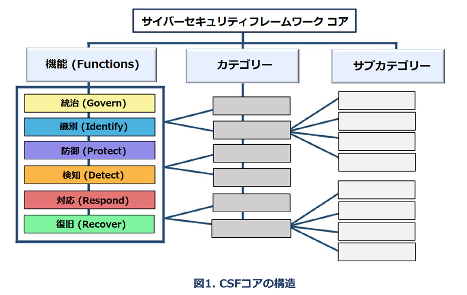
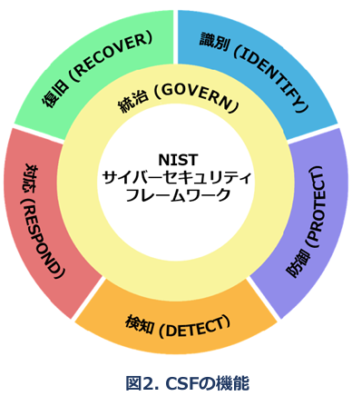

## 2. Introduction to the CSF Core
Appendix A is the CSF Core — a set of cybersecurity outcomes arranged by Function, then Category, and finally Subcategory, as depicted in Fig. 1. These outcomes are not a checklist of actions to perform; specific actions taken to achieve an outcome will vary by organization and use case, as will the individual responsible for those actions. Additionally, the order and size of Functions, Categories, and Subcategories in the Core does not imply the sequence or importance of achieving them. The structure of the Core is intended to resonate most with those charged with operationalizing risk management within an organization.

The CSF Core Functions — GOVERN, IDENTIFY, PROTECT, DETECT, RESPOND, and RECOVER — organize cybersecurity outcomes at their highest level.

• GOVERN (GV) — The organization’s cybersecurity risk management strategy,
expectations, and policy are established, communicated, and monitored. The GOVERN Function provides outcomes to inform what an organization may do to achieve and prioritize the outcomes of the other five Functions in the context of its mission and stakeholder expectations. Governance activities are critical for incorporating cybersecurity into an organization’s broader enterprise risk management (ERM) strategy. GOVERN addresses an understanding of organizational context; the establishment of cybersecurity strategy and cybersecurity supply chain risk management; roles, responsibilities, and authorities; policy; and the oversight of cybersecurity strategy.

• IDENTIFY (ID) — The organization’s current cybersecurity risks are understood. Understanding the organization’s assets (e.g., data, hardware, software, systems, facilities, services, people), suppliers, and related cybersecurity risks enables an organization to prioritize its efforts consistent with its risk management strategy and the mission needs identified under GOVERN. This Function also includes the identification of improvement opportunities for the organization’s policies, plans, processes, procedures, and practices that support cybersecurity risk management to inform efforts under all six Functions.

• PROTECT (PR) — Safeguards to manage the organization’s cybersecurity risks are used. Once assets and risks are identified and prioritized, PROTECT supports the ability to secure those assets to prevent or lower the likelihood and impact of adverse cybersecurity events, as well as to increase the likelihood and impact of taking advantage of opportunities. Outcomes covered by this Function include identity management, authentication, and access control; awareness and training; data security; platform security (i.e., securing the hardware, software, and services of physical and virtual platforms); and the resilience of technology infrastructure.

• DETECT (DE) — Possible cybersecurity attacks and compromises are found and analyzed. DETECT enables the timely discovery and analysis of anomalies, indicators of compromise, and other potentially adverse events that may indicate that cybersecurity attacks and incidents are occurring. This Function supports successful incident response and recovery activities.

• RESPOND (RS) — Actions regarding a detected cybersecurity incident are taken. RESPOND supports the ability to contain the effects of cybersecurity incidents. Outcomes within this Function cover incident management, analysis, mitigation, reporting, and communication.

• RECOVER (RC) — Assets and operations affected by a cybersecurity incident are restored.RECOVER supports the timely restoration of normal operations to reduce the effects of cybersecurity incidents and enable appropriate communication during recovery efforts. 

~~
While many cybersecurity risk management activities focus on preventing negative events from occurring, they may also support taking advantage of positive opportunities. Actions to reduce cybersecurity risk might benefit an organization in other ways, like increasing revenue (e.g., first offering excess facility space to a commercial hosting provider for hosting their own and other organizations’ data centers, then moving a major financial system from the organization’s in-house data center to the hosting provider to reduce cybersecurity risks).  
~~

The Functions should be addressed concurrently. Actions that support GOVERN, IDENTIFY, PROTECT, and DETECT should all happen continuously, and actions that support RESPOND and RECOVER should be ready at all times and happen when cybersecurity incidents occur. All Functions have vital roles related to cybersecurity incidents. GOVERN, IDENTIFY, and PROTECT outcomes help prevent and prepare for incidents, while GOVERN, DETECT, RESPOND, and RECOVER outcomes help discover and manage incidents.

Each Function is named after a verb that summarizes its contents. Each Function is divided into Categories, which are related cybersecurity outcomes that collectively comprise the Function. Subcategories further divide each Category into more specific outcomes of technical and management activities. The Subcategories are not exhaustive, but they describe detailed outcomes that support each Category.

The Functions, Categories, and Subcategories apply to all ICT used by an organization, including information technology (IT), the Internet of Things (IoT), and operational technology (OT). They also apply to all types of technology environments, including cloud, mobile, and artificial intelligence systems. The CSF Core is forward-looking and intended to apply to future changes in technologies and environments.

## 2. CSFコアの概要
付録Aは、CSFコアを「機能 → カテゴリ → サブカテゴリ」の順に整理した、サイバーセキュリティの目指すべき状態（成果）のセットを表している（図1参照）。
これらの成果は、実行すべき行動のチェックリストではない。具体的な取り組みは、組織やユースケースによって異なり、それを実行する担当者もまた異なる。

また、機能・カテゴリ・サブカテゴリの順序や数は、それぞれの実施順や重要度を示すものではない。
CSFコアの構造は、組織内でリスク管理の実行に責任を持つ人々にとって、理解しやすく、かつ実践しやすいものとなるよう設計されている。

CSFコアの機能（統治、識別、防御、検知、対応、復旧）とは、サイバーセキュリティの目指すべき状態（成果）を最上位の観点から分類したものである。

- GOVERN（ガバナンス）
組織のサイバーセキュリティリスクに関する戦略、方針、目標水準が策定・共有され、監視されている状態である。
この機能は、ミッションや利害関係者の要請を踏まえて他の5つの機能の成果を達成・優先するための指針を提供する。
GOVERNには、組織の状況把握、戦略やサプライチェーンリスク管理の策定、責任や権限の明確化、ポリシー策定、戦略の監督などが含まれる。
また、サイバーセキュリティを組織全体のエンタープライズリスク管理（ERM）に統合する上でも重要な役割を担う。

- IDENTIFY（識別）
組織がどのような資産（データ、ハードウェア、ソフトウェア、システム、施設、サービス、人など）やサプライヤー、関連するリスクを把握する機能である。
GOVERNで定めた方針やミッションに沿って、サイバーセキュリティ対策の優先順位を決定する。併せてリスク管理に関係するポリシーや計画、プロセスの改善点を特定する。これにより６つの機能全てにおける対応の基盤を形成する。

- PROTECT（防御）
特定・優先順位付けされた資産やリスクに対し、適切な防御策を講じる機能である。
サイバー攻撃の発生や影響を抑えるだけでなく、新たな取り組みや技術を安全に導入する基盤となる。
この機能の成果には以下が含まれる：
  - ID・認証・アクセス管理
  - セキュリティ教育とトレーニング
  - データの保護
  - プラットフォーム（ハードウェア／ソフトウェア／サービス）の防御
  - 技術インフラの回復力の強化

- DETECT（検知）
攻撃や侵害の兆候を迅速に発見・分析する機能である。
異常やインシデントの初期兆候（IOC)を把握することで、的確な対応や復旧を可能にする。

- RESPOND（対応）
検知されたインシデントに対し、影響を抑える行動を取る機能である。
具体的な成果は、インシデント管理、分析、緩和、報告、関係者との連携・情報共有が含まれる。

- RECOVER（復旧）
インシデントで影響を受けた資産や業務を迅速に正常な状態へ復旧させる機能である。
復旧中に必要な情報共有だけでなく、業務再開までの円滑な調整も含まれる。

サイバーセキュリティ対策は、単に悪影響を回避するだけでなく、新たなビジネスチャンスの創出にもつながる。
たとえば、自社施設の空きスペースをホスティング事業者に提供し、その後、金融システムを自社内のデータセンターから移行することで、コスト削減とセキュリティリスク軽減を同時に実現するといった事例もある。

図2：CSF機能の関係性（車輪構造）
図2では、CSFの各機能が相互に関係していることを表現するため、「車輪（ホイール）」の形で表現している。

たとえば、IDENTIFY で資産を把握し、PROTECT でその資産を守る。
GOVERN や IDENTIFY における計画やテストへの投資は、DETECT による早期検知や、RESPOND／RECOVER における迅速な対応・復旧を支える。
GOVERNは他の5つの機能の実施方針に影響の与えるため、車輪の中心に配置されている。

CSFの各機能は相互に連携しながら同時に機能発揮することが求められる。GOVERN、IDENTIFY、PROTECT、DETECTに関する活動は継続的かつ日常的に実施されるべきであり、RESPONDおよびRECOVERを支える取り組みは常に即応可能な体勢を維持し、インシデント発生時に迅速に機能する必要がある。いずれの機能も、サイバーセキュリティインシデントにおいて重要な役割を担っている。
GOVERN、IDENTIFY、PROTECTは、インシデントの予防と備えを支え、GOVERN、DETECT、RESPOND、RECOVERは、インシデントの検知、対応・復旧を支援する。

各機能は、その内容を表す動詞を名付けられており、複数のカテゴリで構成されている。カテゴリは関連する成果をまとめたもので、さらに技術的・管理的な活動に関する具体的な成果としてサブカテゴリへと細分化される。サブカテゴリは網羅的ではないが、各カテゴリの目的を達成するための詳細な内容を表している。

機能、カテゴリ、サブカテゴリは、組織が活用するあらゆるICT（情報技術［IT］、モノのインターネット［IoT］、オペレーショナルテクノロジー［OT］を含む）に適用される。また、クラウド、モバイル、人工知能など、あらゆる技術環境にも対応している。CSFコアは将来を見据えて設計されており、技術や環境の変化に柔軟に適応できるものとなっている。
