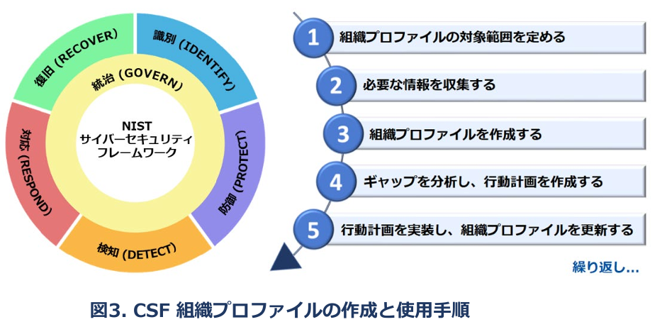
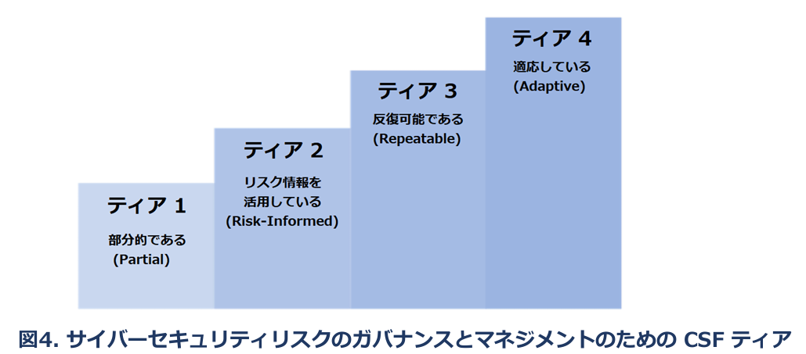

## 3. Introduction to CSF Profiles and Tiers
This section defines the concepts of CSF Profiles and Tiers.
## 3. CSFプロファイルとティアの概要
このセクションでは、CSFプロファイルとティアの概念を定義する。

### 3.1. CSF Profiles
A CSF Organizational Profile describes an organization’s current and/or target cybersecurity posture in terms of the Core’s outcomes. Organizational Profiles are used to understand, tailor, assess, prioritize, and communicate the Core’s outcomes by considering an organization’s mission objectives, stakeholder expectations, threat landscape, and requirements. An organization can then prioritize its actions to achieve specific outcomes and communicate that information to stakeholders.  
Every Organizational Profile includes one or both of the following:  
1. A Current Profile specifies the Core outcomes that an organization is currently achieving (or attempting to achieve) and characterizes how or to what extent each outcome is being achieved.  
2. A Target Profile specifies the desired outcomes that an organization has selected and prioritized for achieving its cybersecurity risk management objectives. A Target Profile considers anticipated changes to the organization’s cybersecurity posture, such as new requirements, new technology adoption, and threat intelligence trends.  

### 3.1 CSFプロファイル
CSF組織プロファイルは、CSFコアの目指すべき状態（成果）に基づき、組織の現在または目標とするサイバーセキュリティ態勢を記述する枠組みである。プロファイルは、組織のミッション、利害関係者の目標水準、脅威動向、関連要件などを踏まえて、CSFコアの目指すべき状態（成果）を理解、調整・評価・優先順位付けされ、関係者間での共有に用いられる。これにより、組織は達成すべき成果を明確にし、優先順位を付けた上で関係者とその内容を共有することができる。

各組織プロファイルには、以下のいずれか、あるいは両方が含まれる。

1. 現状プロファイル
　現時点で組織が達成している成果、または達成を目指している目標を明示し、それぞれの成果・目標がどのように、あるいはどの程度達成されているかを明らかにする。

2. 目標プロファイル
　組織がサイバーセキュリティリスク管理の目的達成に向けて選定・優先付けした目標である。将来的なセキュリティ態勢の変化（新たな要件や技術導入、脅威インテリジェンスの変化など）を見据えて策定される。

~~~
A Community Profile is a baseline of CSF outcomes that is created and published to address shared interests and goals among a number of organizations. A Community Profile is typically developed for a particular sector, subsector, technology, threat type, or other use case. An organization can use a Community Profile as the basis for its own Target Profile. Examples of Community Profiles can be found on the NIST CSF website. 
~~~
~~~
コミュニティプロファイルは、複数の組織に共通する関心や目標に対応するための成果の基準である。通常は、特定の業種・業界、技術領域、脅威の種類、その他の用途に応じて開発される。各組織は、これを自組織の目標プロファイルの土台として利用することができる。具体例は、NIST CSFの公式ウェブサイトで公開されている。
~~~

The steps shown in Fig. 3 and summarized below illustrate one way that an organization could use an Organizational Profile to help inform continuous improvement of its cybersecurity.   
図3及び以下の手順は、組織がプロファイルを活用してサイバーセキュリティ態勢を継続的に改善する一例である。  

1 Scope the Organizational Profile
2 Gather needed information
3 Create the Organizational Profile
4 Analyze gaps and create an action plan
5 Implement action plan and update Profile

Repeat...  

1 組織プロファイルの概要を把握する  
2 必要な情報を収集する  
3 組織プロファイル（現状プロファイル・目標プロファイル）を作成する  
4 ギャップを分析し、計画を作成する  
5 計画を実施し、プロファイルを更新する  

繰り返し...

1. Scope the Organizational Profile. Document the high-level facts and assumptions on which the Profile will be based to define its scope. An organization can have as many Organizational Profiles as desired, each with a different scope. For example, a Profile could address an entire organization or be scoped to an organization’s financial systems or to countering ransomware threats and handling ransomware incidents involving those financial systems.
2. Gather the information needed to prepare the Organizational Profile. Examples of information may include organizational policies, risk management priorities and resources, enterprise risk profiles, business impact analysis (BIA) registers, cybersecurity requirements and standards followed by the organization, practices and tools (e.g., procedures and safeguards), and work roles.
3. Create the Organizational Profile. Determine what types of information the Profile should include for the selected CSF outcomes, and document the needed information. Consider the risk implications of the Current Profile to inform Target Profile planning and prioritization. Also, consider using a Community Profile as the basis for the Target Profile.
4. Analyze the gaps between the Current and Target Profiles, and create an action plan. Conduct a gap analysis to identify and analyze the differences between the Current and Target Profiles, and develop a prioritized action plan (e.g., risk register, risk detail report, Plan of Action and Milestones [POA&M]) to address those gaps.
5. Implement the action plan, and update the Organizational Profile. Follow the action plan to address the gaps and move the organization toward the Target Profile. An action plan may have an overall deadline or be ongoing.

#### プロファイルの作成手順
 1. 組織プロファイルの範囲を定義する  
プロファイルの対象範囲を定めるため、その前提となる要件や仮定を文書化する。組織は必要に応じて複数のプロファイルを作成し、それぞれ異なる範囲を持たせることができる。例えば、組織全体を対象とするプロファイル、組織の財務システムに限定したプロファイル、またはその財務システムに関連するランサムウェア脅威への対応とランサムウェアインシデントの対応に限定したプロファイルを作成することも可能である。  

2. 必要情報の収集  
組織のポリシー、リスク管理の優先事項やリソース、エンタープライズリスクプロファイル、ビジネスインパクト分析（BIA）、適用しているセキュリティ要件・基準、手順・対策に使用する実務ツール類、関係する職務上の役割などの職務情報が含まれる。

3. 組織プロファイルを作成する  
対象とするCSF成果に対し、必要な情報の種類を決定し文書化する。現状プロファイルが示すリスクを踏まえ、目標プロファイルの計画や優先順位付けに反映させる。必要に応じて、コミュニティプロファイルを目標プロファイルの土台として活用することもできる。  

4. ギャップ分析と計画の策定  
現状プロファイルと目標プロファイルの差異ギャップを特定する。その結果に基づき、優先順位を付けた計画（例：リスク登録簿、リスク詳細報告書、アクションプランとマイルストーン[POA&M]等を含む）を策定する。  

5. 計画の実行とプロファイルの更新  
計画に従い改善を進め、目標プロファイルに向けて態勢を発展させていく。計画は期限を設定することも継続的な取り組みとすることも可能である。  

Given the importance of continual improvement, an organization can repeat these steps as often as needed.  
継続的な改善の観点から、これらのステップは必要に応じて繰り返し実施することが推奨される。  

There are additional uses for Organizational Profiles. For example, a Current Profile can be used to document and communicate the organization’s cybersecurity capabilities and known opportunities for improvement with external stakeholders, such as business partners or prospective customers. Also, a Target Profile can help express the organization’s cybersecurity risk management requirements and expectations to suppliers, partners, and other third parties as a target for those parties to achieve.  

**プロファイルの活用例 : 外部関係者との情報共有での有用性**  
CSFプロファイルは、内部のリスク管理だけでなく、外部関係者との情報共有にも有用である。例えば、現状プロファイルはビジネスパートナーや見込み顧客に対し、自組織のセキュリティ体制や現状の能力、改善の方向性を示す資料として活用できる。一方、目標プロファイルは、取引先やサプライヤーに対し自組織が求めるセキュリティ要件や目標とする達成レベルを明確に伝える手段として機能する。これにより、関係者間でのセキュリティに関する共通理解が促進され、信頼性の向上やリスク低減にも寄与することができる。  

### 3.2. CSF Tiers
An organization can choose to use the Tiers to inform its Current and Target Profiles. Tiers characterize the rigor of an organization’s cybersecurity risk governance and management practices, and they provide context for how an organization views cybersecurity risks and the processes in place to manage those risks. The Tiers, as shown in Fig. 4 and notionally illustrated in Appendix B, reflect an organization’s practices for managing cybersecurity risk as Partial (Tier 1), Risk Informed (Tier 2), Repeatable (Tier 3), and Adaptive (Tier 4). The Tiers describe a progression from informal, ad hoc responses to approaches that are agile, risk-informed, and continuously improving. Selecting Tiers helps set the overall tone for how an organization will manage its cybersecurity risks.   

### 3.2. CSF ティア
ティアとは組織のサイバーセキュリティリスクの管理・統制体制の成熟度を示すものである。現在・目標プロファイルを策定する際に使用する概念であり、ティアを活用することで、組織がリスクをどのように捉え、どのような管理体制を構築しているかを評価する際の考慮事項や位置付けが明確となる。  
図4及び付録Bに示されているように、ティアは次の４段階で構成されている。  
ティア１（部分的）：対応は場当たり的かつ非公式で、明確なリスク管理プロセスが確立されていない状態  
ティア２（リスク情報に基づく）：基本的なプロセスが存在し、リスク情報を活用した意思決定が行われている。  
ティア３（反復可能）：標準化されたプロセスが確立され、継続的に適用されている。  
ティア４（適応している）：組織全体がアジャイルかつリスクに応じた高度な管理を実施し、継続的に改善されている。  

ティアの選定により、組織のリスク管理の方針や水準が明確となり、全体的な方向性を定めることができる。  

Tiers should complement an organization’s cybersecurity risk management methodology rather than replace it. For example, an organization can use the Tiers to communicate internally as a benchmark for an organization-wide1 1 For the purposes of this document, the terms “organization-wide” and “enterprise” have the same meaning. approach to managing cybersecurity risks. Progression to higher Tiers is encouraged when risks or mandates are greater or when a cost-benefit analysis indicates a feasible and cost-effective reduction of negative cybersecurity risks.  
なおティアは、既存の組織のサイバーセキュリティリスク管理手法を補完するものであって、代替するものではない。例えば、組織全体のサイバーセキュリティリスク管理アプローチのベンチマークとして内部での共通認識の形成に活用できる。また、リスク状況や外部要件に応じて組織がセキュリティ管理体制を見直す際の基準にもなる。そのため、リスクの増大や法的要件の強化、費用対効果の分析結果により、より高いティアへの移行の判断基準になることもある。  

The NIST CSF website provides additional information on using Profiles and Tiers. It includes pointers to NIST-hosted Organizational Profile templates and a repository of Community Profiles in a variety of machine-readable and human-usable formats.  
NIST CSF 公式サイトでは、プロファイル及びティアの実装に関する補足資料、プロファイルテンプレート、コミュニティプロファイルのレポジトリなどを提供している。これらは人にも機械にも利用可能な形式で整備されている。  
