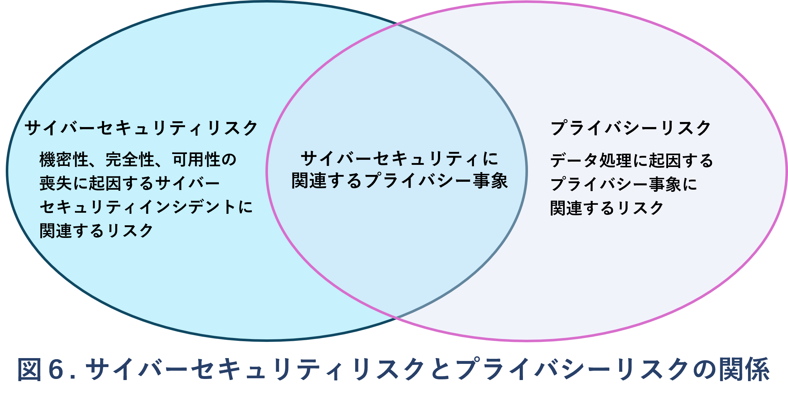

## 5. Improving Cybersecurity Risk Communication and Integration
The CSF’s use will vary based on an organization’s unique mission and risks. With an understanding of stakeholder expectations and risk appetite and tolerance (as outlined in GOVERN), an organization can prioritize cybersecurity activities to make informed decisions about cybersecurity expenditures and actions. An organization may choose to handle risk in one or more ways — including mitigating, transferring, avoiding, or accepting negative risks and realizing, sharing, enhancing, or accepting positive risks — depending on the potential impacts and likelihoods. Importantly, an organization can use the CSF both internally to manage its cybersecurity capabilities and externally to oversee or communicate with third parties.

Regardless of the CSF’s utilization, an organization may benefit from using the CSF as guidance to help it understand, assess, prioritize, and communicate cybersecurity risks and the actions that will manage those risks. The selected outcomes can be used to focus on and implement strategic decisions to improve cybersecurity postures and maintain continuity of missionessential functions while taking priorities and available resources into account.

## 5. サイバーセキュリティリスクの共有※1と統合※2の改善

CSFの活用方法は、組織のミッションやリスクの特性によって異なる。GOVERNで述べられるように、利害関係者の求める目標水準やリスク選好度※3・許容度を踏まえることで、組織はサイバーセキュリティに関する活動の優先順位を定め、経費や対応に関する判断を行える。

組織はリスクの発生確率や影響度に応じて、負のリスク（損失につながるリスク）には、軽減、移転、回避、受容といった対応策を選択できる。
一方で、正のリスク（機会につながるリスク）には実現、共有、強化、受容といった選択肢から対応方法を選ぶことができる。

CSFは、内部ではサイバーセキュリティ能力の整備や運用のために、外部では第三者の管理や対話の土台として活用できる。

活用の形にかかわらず、CSFを指針として用いることで、組織はサイバーセキュリティリスクとその対策の理解・評価・優先順位付け・共有をより効果的に行えうことができる。また組織が重視し選択した「目指すべき目標・成果」群は、組織のリソースや優先事項を考慮することで、サイバーセキュリティ態勢の強化や、ミッション遂行に不可欠な機能の維持に向けた戦略的意思決定の指針として活用できる。

※1 内部・外部の関係者との情報共有  
※2 他の組織活動や経営判断との統合  
※3 どれぐらいのリスクを「進んで」取るか  

### 5.1. Improving Risk Management Communication
The CSF provides a basis for improved communication regarding cybersecurity expectations, planning, and resources. The CSF fosters bidirectional information flow (as shown in the top half of Fig. 5) between executives who focus on the organization’s priorities and strategic direction and managers who manage specific cybersecurity risks that could affect the achievement of those priorities. The CSF also supports a similar flow (as shown in the bottom half of Fig. 5) between managers and the practitioners who implement and operate the technologies. The left side of the figure indicates the importance of practitioners sharing their updates, insights, and concerns with managers and executives.

### 5.1. リスク管理の情報共有の改善
CSFは、サイバーセキュリティに求められる目標水準、計画、リソースに関する情報共有を改善する基盤となる。
図5の上半分に示されるように、CSFは、組織全体の戦略や優先事項を判断する経営層と、具体的なリスクを管理する管理層との間に双方向の情報の流れを形成する。また、図の下半分に示されるように、管理層と、技術の実装・運用を担う実務者との間でも同様の情報共有を支援する。

図の左側は、実務者からの更新情報、現場の洞察、懸念事項を上層部に適切に伝えることの重要性を示している。CSFはこのような組織内のリスクの情報共有構造を確立する枠組みでもある。

Preparing to create and use Organizational Profiles involves gathering information about organizational priorities, resources, and risk direction from executives. Managers then collaborate with practitioners to communicate business needs and create risk-informed Organizational Profiles. Actions to close any gaps identified between the Current and Target Profiles will be implemented by managers and practitioners and will provide key inputs into system-level plans. As the target state is achieved throughout the organization — including through controls and monitoring applied at the system level — the updated results can be shared through risk registers and progress reports. As part of ongoing assessment, managers gain insights to make adjustments that further reduce potential harms and increase potential benefits. 

CSFの導入準備では、まず経営層から組織の優先事項、リソース、リスクに関する方向性を把握する。そのうえで、管理者が実務者と連携し、ビジネス要件を共有しながらリスクに基づく組織プロファイルを作成する。現状プロファイルと目標プロファイルの間に見つかったギャップは、管理者と実務者によって対処され、その内容はシステム単位の計画に反映される。
システムレベルでのコントロールや監視の適用によって、組織全体で目標状態が実現されると、その成果はリスクレジスター※4や進捗報告として共有される。継続的な評価を通じて、管理者は起こり得る損失を抑え、期待される効果を高めるための判断基準を得ることができる。

The GOVERN Function supports organizational risk communication with executives. Executives’ discussions involve strategy, particularly how cybersecurity-related uncertainties might affect the achievement of organizational objectives. These governance discussions support dialogue and agreement about risk management strategies (including cybersecurity supply chain risk); roles, responsibilities, and authorities; policies; and oversight. As executives establish cybersecurity priorities and objectives based on those needs, they communicate expectations about risk appetite, accountability, and resources.  

GOVERN機能は、経営層とのリスク共有を支える基盤である。経営層の議論では、戦略や不確実性が組織目標の達成に及ぼす影響について検討される。こうしたガバナンスに関する対話を通じて、リスク対応戦略（サプライチェーンを含む）、役割や権限、ポリシー、監督体制に関する共通認識が築かれていく。経営層は組織のニーズに基づきサイバーセキュリティの優先事項と目標を策定し、リスク許容度や責任の所在、リソース配分に関する方針や要件を明確に伝える。  

Executives are also responsible for integrating cybersecurity risk management with ERM programs and lower-level risk management programs (see Sec. 5.2). The communications reflected in the top half of Fig. 5 can include considerations for ERM and the lower-level programs and, thus, inform managers and practitioners.

また、サイバーセキュリティ管理とERM（Enterprise Risk Management）および部門レベルのリスク管理との統合も担っている。これにより、図5上部に示されるように、これらの情報共有にはERMや部門レベルのリスク管理に関する考慮事項が含まれ、管理職や実務者へ展開される。

The overall cybersecurity objectives set by executives are informed by and cascade to managers. In a commercial entity, these may apply to a line-of-business or operating division. For government entities, these may be division- or branch-level considerations. When implementing the CSF, managers will focus on how to achieve risk targets through common services, controls, and collaboration, as expressed in the Target Profile and improved through the actions being tracked in the action plan (e.g., risk register, risk detail report, POA&M). 

経営層が策定したサイバーセキュリティの全体目標は、管理者へ共有され、さらに各部門へと展開される。商業企業においては、これらの目標は事業部門や業務部門に適用され、政府機関では、部局や支部レベルでの対応が求められることもある。CSFを実装するにあたり、管理者は、目標プロファイルに示されたリスク目標の達成に向けて、共通サービス、セキュリティ統制、部門間の連携をどう活用するかに注力する。この取り組みは、リスク登録簿、リスク詳細報告書、POA&M（是正措置計画）といった行動計画を通じて継続的に改善・管理される。

Practitioners focus on implementing the target state and measuring changes in operational risk to help plan, carry out, and monitor specific cybersecurity activities. As controls are implemented to manage risk at an acceptable level, practitioners provide managers and executives with the information (e.g., key performance indicators, key risk indicators) they need to understand the organization’s cybersecurity posture, make informed decisions, and maintain or adjust the risk strategy accordingly. Executives can also combine this cybersecurity risk data with information about other types of risk from across the organization. Updates to expectations and priorities are included in updated Organizational Profiles as the cycle repeats.

実務者は、目標とするセキュリティ状態の実現と運用上のリスク変化の測定に注力し、サイバーセキュリティ対策の計画、実施、監視を担う。リスクを許容可能な水準に抑えるためのコントロールが導入される中で、実務者は主要業績評価指標（KPI）や主要リスク指標（KRI）などの情報を通じて、マネージャーや経営幹部に組織のセキュリティ状況を伝達する。経営層はこの情報を、他の種類のリスク情報と統合し、自組織のリスク戦略を維持・見直すための意思決定に役立てる。こうしたプロセスの繰り返すなかで、方針と優先事項が更新され、組織プロファイルの更新に反映される。

### 5.2. Improving Integration with Other Risk Management Programs
Every organization faces numerous types of ICT risk (e.g., privacy, supply chain, artificial intelligence) and may use frameworks and management tools that are specific to each risk. Some organizations integrate ICT and all other risk management efforts at a high level by using ERM, while others keep the efforts separate to ensure adequate attention on each. Small organizations by their nature may monitor risk at the enterprise level, while larger companies may maintain separate risk management efforts integrated into the ERM.

すべての組織はICTに関連する多様なリスク（プライバシー、サプライチェーン、AIなど）を抱えており、それぞれに特化したフレームワークやツールを活用することがある。ERMを通じて全体的な統合を図る組織もあれば、個別対応によって各リスクに注力する組織も存在する。規模の小さな組織では、リスク管理はエンタープライズ単位で行われ、大規模組織ではERMに統合された個別プログラムが併存することが多い。

Organizations can employ an ERM approach to balance a portfolio of risk considerations, including cybersecurity, and make informed decisions. Executives receive significant input about current and planned risk activities as they integrate governance and risk strategies with results from previous uses of the CSF. The CSF helps organizations to translate their terminology for cybersecurity and cybersecurity risk management into general risk management language that executives will understand.

経営層は、CSFの実施によって得られた結果を踏まえ、組織の統治体制やリスク戦略を適宜見直す。CSFは、サイバーセキュリティの専門的な概念を、経営層にも理解しやすいリスクマネジメントの言葉に置き換えるための橋渡しとして機能する。

NIST resources that describe the mutual relationship between cybersecurity risk management and ERM include:   
以下のNIST資料は、CSFとERMの連携を説明する：

- NIST Cybersecurity Framework 2.0 
– Enterprise Risk Management Quick-Start Guide
- NIST Interagency Report (IR) 8286, Integrating Cybersecurity and Enterprise Risk Management (ERM)
- IR 8286A, Identifying and Estimating Cybersecurity Risk for Enterprise Risk Management
- IR 8286B, Prioritizing Cybersecurity Risk for Enterprise Risk Management
- IR 8286C, Staging Cybersecurity Risks for Enterprise Risk Management and Governance Oversight
- IR 8286D, Using Business Impact Analysis to Inform Risk Prioritization and Response
- SP 800-221, Enterprise Impact of Information and Communications Technology Risk: Governing and Managing ICT Risk Programs Within an Enterprise Risk Portfolio
- SP 800-221A, Information and Communications Technology (ICT) Risk Outcomes: Integrating ICT Risk Management Programs with the Enterprise Risk Portfolio

- NIST CSF 2.0 Enterprise Risk Management Quick-Start Guide
- NIST IR 8286: ERMとサイバーセキュリティの統合
- IR 8286A: サイバーリスクの特定と定量化
- IR 8286B: サイバーリスクの優先順位付け
- IR 8286C: サイバーリスクの段階評価
- IR 8286D: ビジネス影響分析によるリスク対応戦略
- SP 800-221：情報通信技術（ICT）リスクの企業への影響：企業リスクポートフォリオにおけるICTリスクプログラムの統治と管理
- SP 800-221A：情報通信技術（ICT）リスクの成果 
― ICTリスク管理プログラムと企業リスクポートフォリオの統合

An organization may also find the CSF beneficial for integrating cybersecurity risk management with individual ICT risk management programs, such as: 

CSFは、サイバーセキュリティリスク管理を個別のICTリスク管理プログラムと統合する際にも有効である。以下にその具体例を示す。

- Cybersecurity risk management and assessment:  
- サイバーセキュリティリスク管理と評価  

The CSF can be integrated with established cybersecurity risk management and assessment programs, such as SP 800- 37, Risk Management Framework for Information Systems and Organizations, and SP 800-30, Guide for Conducting Risk Assessments from the NIST Risk Management Framework (RMF). For an organization using the NIST RMF and its suite of publications, the CSF can be used to complement the RMF’s approach to selecting and prioritizing controls from SP 800-53, Security and Privacy Controls for Information Systems and Organizations.

CSF は、既存のリスク管理および評価プログラムと組み合わせて活用するかとができる。たとえば、SP 800-37「情報システムおよび組織のためのリスク管理フレームワーク」や、SP 800-30「リスク評価の実施ガイド（NIST RMF）」などがある。NIST RMFおよび関連文書を採用している組織では、CSF を用いることで、SP 800-53「情報システムおよび組織のためのセキュリティとプライバシー管理策」からコントロールを選定し優先付けするRMFのアプローチを補完できる。

- Privacy risks:  
- プライバシーリスク

While cybersecurity and privacy are independent disciplines, their objectives overlap in certain circumstances, as illustrated in Fig. 6. Cybersecurity risk management is essential for addressing privacy risks related to the loss of the confidentiality, integrity, and availability of individuals’ data. For example, data breaches could lead to identity theft. However, privacy risks can also arise by means that are unrelated to cybersecurity incidents.  

サイバーセキュリティとプライバシーは本来独立した分野だが、ある状況では両者の目的が重複する。図6はその関係性を示している。  
サイバーセキュリティリスク管理は、個人データの機密性・完全性・可用性の喪失に起因するプライバシーリスクへの対応において不可欠である。たとえば、データ漏洩は個人情報の盗用やなりすましなどを引き起こす可能性がある。ただし、プライバシーリスクは必ずしもサイバーセキュリティ上のインシデントに限らず、それ以外の要因からも発生し得る。  

An organization processes data to achieve mission or business purposes, which can sometimes give rise to privacy events whereby individuals may experience problems as a result of the data processing. These problems can be expressed in various ways, but NIST describes them as ranging from dignity-type effects (e.g., embarrassment or stigma) to more tangible harms (e.g., discrimination, economic loss, or physical harm).

組織はミッションや事業目的の達成のために個人データを処理する。その過程で、処理のあり方によって個人に不利益が及ぶプライバシー上の事象（プライバシーイベント）が発生する場合がある。こうした不利益はさまざまな形で現れるが、NISTはそれらを、「尊厳に関わる影響（例：恥ずかしさやスティグマ）」から「実質的な損害（例：差別、経済的損失、身体的被害）」に至るまでの幅広い影響として定義している。

The NIST Privacy Framework and Cybersecurity Framework can be used together to address the different aspects of cybersecurity and privacy risks. Additionally, NIST’s Privacy Risk Assessment Methodology (PRAM) has a catalog of example problems for use in privacy risk assessments.  
NISTのプライバシーフレームワークとサイバーセキュリティフレームワーク（CSF）は、それぞれ異なる側面のリスクに対応するために併用可能である。また、NISTのプライバシーリスク評価手法（PRAM）には、プライバシーリスク評価に使用できる典型的な問題例のカタログが用意されている。  

- Supply chain risks: 
- サプライチェーンリスク  

An organization can use the CSF to foster cybersecurity risk oversight and communications with stakeholders across supply chains. All types of technology rely on a complex, globally distributed, extensive, and interconnected supply chain ecosystem with geographically diverse routes and multiple levels of outsourcing. This ecosystem is composed of public- and private-sector entities (e.g., acquirers, suppliers, developers, system integrators, external system service providers, and other technology-related service providers) that interact to research, develop, design, manufacture, acquire, deliver, integrate, operate, maintain, dispose of, and otherwise utilize or manage technology products and services. These interactions are shaped and influenced by technologies, laws, policies, procedures, and practices.  

CSFは、組織がサプライチェーン全体におけるサイバーセキュリティリスクを可視化・管理し、関係者とのリスクに関する情報共有の強化に活用できる。あらゆる種類の技術は、地理的に分散し、複雑かつ多層的に委託されたグローバルなサプライチェーンエコシステムに依存している。このエコシステムには、購入者、サプライヤー、開発者、システムインテグレーター、外部システムサービス提供者など、技術に関わる多数の公的・民間の関係する個人や組織が関与し、製品やサービスの研究、開発、設計、製造、取得、提供、統合、運用、保守、廃棄、その他の利用や管理の各工程で相互に連携している。これらの関係は単に技術的な要素だけでなく、法制度、ポリシー、手続き、慣行などの影響も受けている。  

Given the complex and interconnected relationships in this ecosystem, supply chain risk management (SCRM) is critical for organizations. Cybersecurity SCRM (C-SCRM) is a systematic process for managing exposure to cybersecurity risk throughout supply chains and developing appropriate response strategies, policies, processes, and procedures. The Subcategories within the CSF C-SCRM Category [GV.SC] provide a connection between outcomes that focus purely on cybersecurity and those that focus on C-SCRM. SP 800-161r1 (Revision 1), Cybersecurity Supply Chain Risk Management Practices for Systems and Organizations, provides in-depth information on C-SCRM.  
このような複雑で相互依存的な構造にあることから、サプライチェーンリスク管理（SCRM）は組織にとって極めて重要である。特にサイバーセキュリティに特化したSCRM（C-SCRM）は、サプライチェーン全体にわたるリスクへの対応策・戦略・ポリシー・手順を整備・実装する体系的なプロセスとなっている。  
CSFのC-SCRMカテゴリ [GV.SC] に含まれるサブカテゴリは、従来のサイバーセキュリティの成果とC-SCRMに特化した成果との橋渡しとなる。また、NISTの SP 800-161 Rev.1『システムおよび組織のためのサイバーセキュリティ・サプライチェーンリスク管理実践』 では、この分野に関する詳細な指針を示している。  

- Risks from emerging technologies: 
- 新興技術に起因するリスク  

As new technologies and new applications of technology become available, new risks become clear. A contemporary example is artificial intelligence (AI), which has cybersecurity and privacy risks, as well as many other types of risk. The NIST Artificial Intelligence Risk Management Framework (AI RMF) was developed to help address these risks. Treating AI risks alongside other enterprise risks (e.g., financial, cybersecurity, reputational, and privacy) will yield a more integrated outcome and organizational efficiencies. Cybersecurity and privacy risk management considerations and approaches are applicable to the design, development, deployment, evaluation, and use of AI systems. The AI RMF Core uses Functions, Categories, and Subcategories to describe AI outcomes and help manage risks related to AI.

新たな技術やその応用技術の登場により、新種のリスクも明らかになってきている。近年の代表例が人工知能（AI）であり、これはサイバーセキュリティリスクやプライバシーリスクに加え、財務リスク、評判リスクなどの多様なリスクを伴う。
これらのリスクに対応するために、NISTは人工知能リスク管理フレームワーク（AI RMF）を策定した。
AIに関するリスクを、他の企業リスク（財務、サイバーセキュリティ、プライバシー、評判など）と一体的に取り扱うことで、より統合された対応と組織運営の効率化が実現できる。
サイバーセキュリティおよびプライバシーのリスク管理に関する考慮事項や手法は、AIシステムの設計・開発・導入・評価・運用の各段階に適用可能である。
AI RMFの「コア」では、機能、カテゴリ、サブカテゴリという構造を用いて、AIの成果とそれに伴うリスク管理の方法を整理している。
