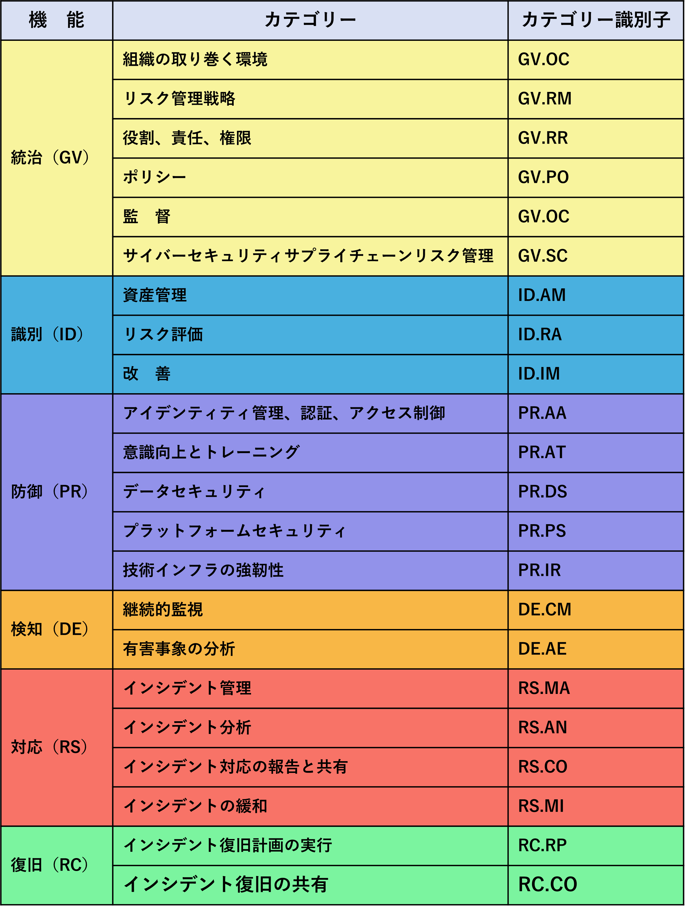

## Appendix A. CSF Core
This appendix describes the Functions, Categories, and Subcategories of the CSF Core. Table 1 lists the CSF 2.0 Core Function and Category names and unique alphabetic identifiers. Each Function name in the table is linked to its portion of the appendix. The order of Functions, Categories, and Subcategories of the Core is not alphabetical; it is intended to resonate most with those charged with operationalizing risk management within an organization.
この付録では、CSF コアの機能、カテゴリ、およびサブカテゴリについて説明する。表 1 には、CSF 2.0 コアの機能およびカテゴリ名、およびユニークなアルファベット識別子が記載されている。表内の各機能名は、付録内の該当する部分にリンクされている。コアの機能、カテゴリ、およびサブカテゴリの順序はアルファベット順ではない。これは組織内でリスク管理を実践する責任者が理解しやすい順序となっている。  

The CSF Core, Informative References, and Implementation Examples are available on the CSF 2.0 website and through the CSF 2.0 Reference Tool, which allows users to explore them and export them in human- and machine-readable formats. The CSF 2.0 Core is also available in a legacy format similar to that of CSF 1.1.

CSF コア、参考資料、実装例については、CSF 2.0 ウェブサイトおよび CSF 2.0 リファレンスツールから参照できる。このツールを使用すると、人間および機械が読み取り可能な形式でエクスポートできる。CSF 2.0 コアは、CSF 1.1 と同様のレガシー形式でも利用できる。  

### GOVERN (GV): The organization’s cybersecurity risk management strategy, expectations, and policy are established, communicated, and monitored

- **Organizational Context (GV.OC)**: The circumstances — mission, stakeholder expectations, dependencies, and legal, regulatory, and contractual requirements — surrounding the organization’s cybersecurity risk management decisions are understood
  - GV.OC-01: The organizational mission is understood and informs cybersecurity risk management
  - GV.OC-02: Internal and external stakeholders are understood, and their needs and expectations regarding cybersecurity risk management are understood and considered
  - GV.OC-03: Legal, regulatory, and contractual requirements regarding cybersecurity — including privacy and civil liberties obligations — are understood and managed
  - GV.OC-04: Critical objectives, capabilities, and services that external stakeholders depend on or expect from the organization are understood and communicated
  - GV.OC-05: Outcomes, capabilities, and services that the organization depends on are understood and communicated  

### ガバナンス (GV): 組織のサイバーセキュリティリスク管理戦略、目標水準、およびポリシーが確立され、共有され、監視されている。

- **組織のコンテキスト (GV.OC)**: 組織のサイバーセキュリティリスク管理の決定を取り巻く状況 (使命、利害関係者の要求、依存関係、および法的、規制、契約上の要件) が理解されている。
  - GV.OC-01: 組織のミッションが理解され、サイバーセキュリティリスク管理に反映されている。  
  - GV.OC-02: 内部および外部の利害関係者が理解され、サイバーセキュリティリスク管理に関する彼らのニーズと要求が理解され、考慮されている。  
  - GV.OC-03: サイバーセキュリティに関する法的、規制、契約上の要件（プライバシーと市民の自由に関する義務を含む）が理解され、管理されている。
  - GV.OC-04: 外部利害関係者が組織に依存または期待する重要な目標、能力、およびサービスが理解され、共有されている。
- GV.OC-05: 組織が依存する成果、能力、およびサービスが理解され、共有されている。

- **Risk Management Strategy (GV.RM)**: The organization’s priorities, constraints, risk tolerance and appetite statements, and assumptions are established, communicated, and used to support operational risk decisions
  - GV.RM-01: Risk management objectives are established and agreed to by organizational stakeholders
  - GV.RM-02: Risk appetite and risk tolerance statements are established, communicated, and maintained
  - GV.RM-03: Cybersecurity risk management activities and outcomes are included in enterprise risk management processes
  - GV.RM-04: Strategic direction that describes appropriate risk response options is established and communicated
  - GV.RM-05: Lines of communication across the organization are established for cybersecurity risks, including risks from suppliers and other third parties
  - GV.RM-06: A standardized method for calculating, documenting, categorizing, and prioritizing cybersecurity risks is established and communicated
  - GV.RM-07: Strategic opportunities (i.e., positive risks) are characterized and are included in organizational cybersecurity risk discussions

- **リスク管理戦略 (GV.RM)**：組織の優先事項、制約、リスク許容およびリスク選好に関する声明、および仮定が確立され、共有され、業務上のリスクに関する意思決定の支援に利用される。
  - GV.RM-01: リスク管理の目標が確立され、組織の利害関係者に合意されている。
  - GV.RM-02: リスク許容度およびリスク選好度の声明が確立され、共有され、維持されている。
  - GV.RM-03: サイバーセキュリティリスク管理活動およびその結果が、企業リスク管理プロセスに含まれている。
  - GV.RM-04: 適切なリスク対応オプションを説明する戦略的方向性が確立され、共有されている。
  - GV.RM-05: サイバーセキュリティリスク（サプライヤーやその他の第三者からのリスクを含む）に関する組織内の情報共有ラインが確立されている。  
  - GV.RM-06: サイバーセキュリティリスクの予測、文書化、分類、優先順位付けの標準化された方法が確立され、共有されている。  
  - GV.RM-07: 戦略的機会（すなわち、ポジティブなリスク）が明確化され、組織のサイバーセキュリティリスクの議論に組み込まれている。

- **Roles, Responsibilities, and Authorities (GV.RR)**: Cybersecurity roles, responsibilities, and authorities to foster accountability, performance assessment, and continuous improvement are established and communicated 
  - GV.RR-01: Organizational leadership is responsible and accountable for cybersecurity risk and fosters a culture that is risk-aware, ethical, and continually improving 
  - GV.RR-02: Roles, responsibilities, and authorities related to cybersecurity risk management are established, communicated, understood, and enforced 
  - GV.RR-03: Adequate resources are allocated commensurate with the cybersecurity risk strategy, roles, responsibilities, and policies 
  - GV.RR-04: Cybersecurity is included in human resources practices
- **役割、責任、および権限 (GV.RR)**: 説明責任、実績評価、および継続的な改善を促進するためのサイバーセキュリティの役割、責任、および権限が確立され、共有されている。  
  - GV.RR-01: 組織の管理職は、サイバーセキュリティリスクについて責任と説明責任を負い、リスクを認識し、倫理的で、継続的に改善する文化を醸成されている。
  - GV.RR-02: サイバーセキュリティリスク管理に関連する役割、責任、権限が確立され、共有され、理解され、実施されている。 
  - GV.RR-03: サイバーセキュリティリスク戦略、役割、責任、およびポリシーに相当する十分なリソースが割り当てられている 
  - GV.RR-04: サイバーセキュリティが人事管理に組み込まれている

- **Policy (GV.PO)**: Organizational cybersecurity policy is established, communicated, and enforced 
  - GV.PO-01: Policy for managing cybersecurity risks is established based on organizational context, cybersecurity strategy, and priorities and is communicated and enforced 
  - GV.PO-02: Policy for managing cybersecurity risks is reviewed, updated, communicated, and enforced to reflect changes in requirements, threats, technology, and organizational mission

- **ポリシー (GV.PO)**: 組織のサイバーセキュリティポリシーが策定され、共有され、実施されている。 
  - GV.PO-01: 組織の状況、サイバーセキュリティ戦略、優先事項に基づいて、サイバーセキュリティリスクを管理するためのポリシーが策定され、共有され、実施されている。 
  - GV.PO-02: 要件、脅威、技術、組織の使命の変化を反映するために、サイバーセキュリティリスクを管理するためのポリシーがレビュー、更新、共有、実施されている。

- **Oversight (GV.OV)**: Results of organization-wide cybersecurity risk management activities and performance are used to inform, improve, and adjust the risk management strategy 
  - GV.OV-01: Cybersecurity risk management strategy outcomes are reviewed to inform and adjust strategy and direction 
  - GV.OV-02: The cybersecurity risk management strategy is reviewed and adjusted to ensure coverage of organizational requirements and risks 
  - GV.OV-03: Organizational cybersecurity risk management performance is evaluated and reviewed for adjustments needed 

- **監督 (GV.OV)**: 組織全体のサイバーセキュリティリスク管理活動およびパフォーマンスの結果は、リスク管理戦略の情報提供、改善、調整に活用される 
  - GV.OV-01: サイバーセキュリティリスク管理戦略の結果をレビューし、戦略と方向性を情報提供し、調整する 
  - GV.OV-02: サイバーセキュリティリスク管理戦略をレビューし、組織の要件とリスクを確実にカバーするように調整する 
  - GV.OV-03: 組織のサイバーセキュリティリスク管理の成果を評価し、必要な調整についてレビューする

- **Cybersecurity Supply Chain Risk Management (GV.SC)**: Cyber supply chain risk management processes are identified, established, managed, monitored, and improved by organizational stakeholders 
  - GV.SC-01: A cybersecurity supply chain risk management program, strategy, objectives, policies, and processes are established and agreed to by organizational stakeholders 
  - GV.SC-02: Cybersecurity roles and responsibilities for suppliers, customers, and partners are established, communicated, and coordinated internally and externally 
  - GV.SC-03: Cybersecurity supply chain risk management is integrated into cybersecurity and enterprise risk management, risk assessment, and improvement processes 
  - GV.SC-04: Suppliers are known and prioritized by criticality 
  - GV.SC-05: Requirements to address cybersecurity risks in supply chains are established, prioritized, and integrated into contracts and other types of agreements with suppliers and other relevant third parties 
  - GV.SC-06: Planning and due diligence are performed to reduce risks before entering into formal supplier or other third-party relationships 
  - GV.SC-07: The risks posed by a supplier, their products and services, and other third parties are understood, recorded, prioritized, assessed, responded to, and monitored over the course of the relationship 
  - GV.SC-08: Relevant suppliers and other third parties are included in incident planning, response, and recovery activities 
  - GV.SC-09: Supply chain security practices are integrated into cybersecurity and enterprise risk management programs, and their performance is monitored throughout the technology product and service life cycle 
  - GV.SC-10: Cybersecurity supply chain risk management plans include provisions for activities that occur after the conclusion of a partnership or service agreement 

- **サイバーセキュリティサプライチェーンリスク管理 (GV.SC)**：サイバーサプライチェーンリスク管理プロセスが、組織の利害関係者によって特定、確立、管理、監視、および改善されている。 
  - GV.SC-01：サイバーセキュリティサプライチェーンリスク管理プログラム、戦略、目標、ポリシー、およびプロセスが確立され、組織の利害関係者によって合意されている。
  - GV.SC-02: サプライヤー、顧客、およびパートナーのサイバーセキュリティの役割と責任が確立され、社内外に共有され、調整されている。 
  - GV.SC-03: サイバーセキュリティサプライチェーンリスク管理が、サイバーセキュリティおよび企業リスク管理、リスク評価、および改善プロセスに統合されている。 
  - GV.SC-04: サプライヤーが特定され、重要度に応じて優先順位付けされている。
  - GV.SC-05: サプライチェーンにおけるサイバーセキュリティリスクに対応するための要件が確立され、優先順位付けされ、サプライヤーおよびその他の関連する第三者との契約やその他の合意に統合されている。 
  - GV.SC-06: 正式なサプライヤーまたはその他の第三者との関係を開始する前に、リスクを軽減するための計画とデューデリジェンスが実施されている 
  - GV.SC-07：サプライヤー、その製品およびサービス、およびその他の第三者がもたらすリスクは、関係の過程を通じて理解、記録、優先順位付け、評価、対応、および監視されている。
  - GV.SC-08：関連するサプライヤーおよびその他の第三者は、インシデントの計画、対応、および復旧活動に含まれている。
  - GV.SC-09: サプライチェーンのセキュリティ実装は、サイバーセキュリティおよび企業リスク管理プログラムに統合され、そのパフォーマンスは、技術製品およびサービスのライフサイクル全体を通じて監視される。  
  - GV.SC-10: サイバーセキュリティサプライチェーンリスク管理計画には、パートナーシップまたはサービス契約の終了後に実施される活動に関する規定が含まれる。

### IDENTIFY (ID): The organization’s current cybersecurity risks are understood 
- **Asset Management (ID.AM)**: Assets (e.g., data, hardware, software, systems, facilities, services, people) that enable the organization to achieve business purposes are identified and managed consistent with their relative importance to organizational objectives and the organization’s risk strategy 
  - AM-01: Inventories of hardware managed by the organization are maintained 
  - AM-02: Inventories of software, services, and systems managed by the organization are maintained 
  - AM-03: Representations of the organization’s authorized network communication and internal and external network data flows are maintained 
  - AM-04: Inventories of services provided by suppliers are maintained 
  - AM-05: Assets are prioritized based on classification, criticality, resources, and impact on the mission 
  - AM-07: Inventories of data and corresponding metadata for designated data types are maintained 
  - AM-08: Systems, hardware, software, services, and data are managed throughout their life cycles

### 識別（ID）：組織の現在のサイバーセキュリティリスクが理解されている。
- **資産管理（ID.AM）**：組織が事業目的を達成するために必要な資産（データ、ハードウェア、ソフトウェア、システム、施設、サービス、人材など）を、組織の目標およびリスク戦略に対する相対的な重要度に応じて識別し、管理している。
  - AM-01：組織が管理するハードウェアの資産台帳が維持されている。
  - AM-02: 組織が管理するソフトウェア、サービス、システムの資産台帳が維持されている。 
  - AM-03: 組織の許可されたネットワーク通信および内部および外部ネットワークのデータフローが維持されている。
  - AM-04: サービスプロバイダーが提供するサービス一覧が維持されている。 
  - AM-05: 資産は、分類、重要度、リソース、およびミッションへの影響に基づいて優先順位付けされている 
  - AM-07: 指定データタイプに関するデータおよび対応するメタデータのリストが維持されている。
  - AM-08: システム、ハードウェア、ソフトウェア、サービス、およびデータは、そのライフサイクルを通じて管理されている

- **Risk Assessment (ID.RA)**: The cybersecurity risk to the organization, assets, and individuals is understood by the organization 
  - RA-01: Vulnerabilities in assets are identified, validated, and recorded 
  - RA-02: Cyber threat intelligence is received from information sharing forums and sources 
  - RA-03: Internal and external threats to the organization are identified and recorded 
  - RA-04: Potential impacts and likelihoods of threats exploiting vulnerabilities are identified and recorded 
  - RA-05: Threats, vulnerabilities, likelihoods, and impacts are used to understand inherent risk and inform risk response prioritization 
  - RA-06: Risk responses are chosen, prioritized, planned, tracked, and communicated 
  - RA-07: Changes and exceptions are managed, assessed for risk impact, recorded, and tracked 
  - RA-08: Processes for receiving, analyzing, and responding to vulnerability disclosures are established 
  - RA-09: The authenticity and integrity of hardware and software are assessed prior to acquisition and use 
  - RA-10: Critical suppliers are assessed prior to acquisition

- **リスク評価 (ID.RA)**：組織、資産、および個人に対するサイバーセキュリティリスクが組織として理解されている。 
  - RA-01：資産の脆弱性が特定、検証、および記録されている。 
  - RA-02：情報共有フォーラムや情報源からサイバー脅威インテリジェンスを収集、受信している。 
  - RA-03：組織に対する内部および外部の脅威が特定、記録されている。
  - RA-04: 脆弱性を悪用する脅威の潜在的な影響と発生の可能性が特定され、記録されている。 
  - RA-05: 脅威、脆弱性、発生の可能性、および影響は、固有のリスクを理解し、リスク対応優先順位を決定するために使用されている。 
  - RA-06: リスク対応が選択され、優先順位付け、計画、追跡、および共有されている。
  - RA-07: 変更および例外は、管理され、リスクの影響について評価され、記録され、追跡される。 
  - RA-08: 脆弱性の開示を受け、分析し、対応するためのプロセスが確立されている。 
  - RA-09: ハードウェアおよびソフトウェアは、取得および使用前に、その信頼性および完全性が評価されている。 
  - RA-10: 重要なサプライヤーは、取得前に評価されている。

- **Improvement (ID.IM)**: Improvements to organizational cybersecurity risk management processes, procedures and activities are identified across all CSF Functions 
  - IM-01: Improvements are identified from evaluations 
  - IM-02: Improvements are identified from security tests and exercises, including those done in coordination with suppliers and relevant third parties 
  - IM-03: Improvements are identified from execution of operational processes, procedures, and activities 
  - IM-04: Incident response plans and other cybersecurity plans that affect operations are established, communicated, maintained, and improved

- **改善 (ID.IM)**: CSF 機能全体において、組織のサイバーセキュリティリスク管理プロセス、手順、および活動の改善点を特定する 
  - IM-01：評価から改善点を特定する。 
  - IM-02：サプライヤーや関連する第三者機関と協力して実施するセキュリティテストや演習から改善点を特定する。 
  - IM-03：運用プロセス、手順、および活動の実行から改善点を特定する。 
  - IM-04：運用に影響を与えるインシデント対応計画およびその他のサイバーセキュリティ計画を策定、共有、維持、および改善する。

### PROTECT (PR): Safeguards to manage the organization’s cybersecurity risks are used 
- **Identity Management, Authentication, and Access Control (PR.AA)**: Access to physical and logical assets is limited to authorized users, services, and hardware and managed commensurate with the assessed risk of unauthorized access 
  - AA-01: Identities and credentials for authorized users, services, and hardware are managed by the organization 
  - AA-02: Identities are proofed and bound to credentials based on the context of interactions 
  - AA-03: Users, services, and hardware are authenticated 
  - AA-04: Identity assertions are protected, conveyed, and verified 
  - AA-05: Access permissions, entitlements, and authorizations are defined in a policy, managed, enforced, and reviewed, and incorporate the principles of least privilege and separation of duties 
  - AA-06: Physical access to assets is managed, monitored, and enforced commensurate with risk 

### 保護 (PR): 組織のサイバーセキュリティリスクを管理するための保護手段を実装する。 
- **ID 管理、認証、およびアクセス制御 (PR.AA)**: 物理的および論理的資産へのアクセスは、許可されたユーザー、サービス、およびハードウェアに限定され、不正アクセスによるリスクの評価に応じて管理される。 
  - AA-01: 許可されたユーザー、サービス、およびハードウェアの ID および認証情報は、組織によって管理される。
  - AA-02: 識別情報は、接続・利用時の状況に応じて、認証情報と紐付けられ、確認される。
  - AA-03: ユーザー、サービス、およびハードウェアは認証されている 
  - AA-04: 識別情報のアサーション※5は、保護され、伝達され、検証される。
  - AA-05: アクセス権限、権限付与、および承認はポリシーで定義され、管理、実施、およびレビューされ、最小権限の原則と職務分離の原則が組み込まれている。 
  - AA-06: 資産への物理的アクセスは、リスクに応じて管理、監視、および制御されている。 

※5 ユーザーの認証状態や属性（氏名、役割、所属など）を他のシステムに伝える信頼可能な情報単位

- **Awareness and Training (PR.AT)**: The organization’s personnel are provided with cybersecurity awareness and training so that they can perform their cybersecurity-related tasks 
  - AT-01: Personnel are provided wits and training so that they possess the knowledge and skills to perform general tasks with cybersecurity risks in mind o PR.AT-02: Individuals in specialized roles are provided with awareness and training so that they possess the knowledge and skills to perform relevant tasks with cybersecurity risks in mind 

- **Data Security (PR.DS)**: Data are managed consistent with the organization’s risk strategy to protect the confidentiality, integrity, and availability of information 
  - DS-01: The confidentiality, integrity, and availability of data-at-rest are protected 
  - DS-02: The confidentiality, integrity, and availability of data-in-transit are protected 
  - DS-10: The confidentiality, integrity, and availability of data-in-use are protected 
  - DS-11: Backups of data are created, protected, maintained, and tested 

- **Platform Security (PR.PS)**: The hardware, software (e.g., firmware, operating systems, applications), and services of physical and virtual platforms are managed consistent with the organization’s risk strategy to protect their confidentiality, integrity, and availability 
  - PS-01: Configuration management practices are established and applied 
  - PS-02: Software is maintained, replaced, and removed commensurate with risk 
  - PS-03: Hardware is maintained, replaced, and removed commensurate with risk 
  - PS-04: Log records are generated and made available for continuous monitoring 
  - PS-05: Installation and execution of unauthorized software are prevented 
  - PS-06: Secure software development practices are integrated, and their performance is monitored throughout the software development life cycle 

- **Technology Infrastructure Resilience (PR.IR)**: Security architectures are managed with the organization’s risk strategy to protect asset confidentiality, integrity, and availability, and organizational resilience 
  - IR-01: Networks and environments are protected from unauthorized logical access and usage 
  - IR-02: The organization’s technology assets are protected from environmental threats 
  - IR-03: Mechanisms are implemented to achieve resilience requirements in normal and adverse situations 
  - IR-04: Adequate resource capacity to ensure availability is maintained

### DETECT (DE): Possible cybersecurity attacks and compromises are found and analyzed 
- **Continuous Monitoring (DE.CM)**: Assets are monitored to find anomalies, indicators of compromise, and other potentially adverse events 
  - CM-01: Networks and network services are monitored to find potentially adverse events 
  - CM-02: The physical environment is monitored to find potentially adverse events 
  - CM-03: Personnel activity and technology usage are monitored to find potentially adverse events 
  - CM-06: External service provider activities and services are monitored to find potentially adverse events 
  - CM-09: Computing hardware and software, runtime environments, and their data are monitored to find potentially adverse events 

- **Adverse Event Analysis (DE.AE)**: Anomalies, indicators of compromise, and other potentially adverse events are analyzed to characterize the events and detect cybersecurity incidents 
  - AE-02: Potentially adverse events are analyzed to better understand associated activities 
  - AE-03: Information is correlated from multiple sources 
  - AE-04: The estimated impact and scope of adverse events are understood 
  - AE-06: Information on adverse events is provided to authorized staff and tools 
  - AE-07: Cyber threat intelligence and other contextual information are integrated into the analysis 
  - AE-08: Incidents are declared when adverse events meet the defined incident criteria

### RESPOND (RS): Actions regarding a detected cybersecurity incident are taken 
- **Incident Management (RS.MA)**: Responses to detected cybersecurity incidents are managed 
  - RS.MA-01: The incident response plan is executed in coordination with relevant third parties once an incident is declared  
  - RS.MA-02: Incident reports are triaged and validated 
  - RS.MA-03: Incidents are categorized and prioritized 
  - RS.MA-04: Incidents are escalated or elevated as needed 
  - RS.MA-05: The criteria for initiating incident recovery are applied 

- **Incident Analysis (RS.AN)**: Investigations are conducted to ensure effective response and support forensics and recovery activities 
  - RS.AN-03: Analysis is performed to establish what has taken place during an incident and the root cause of the incident 
  - RS.AN-06: Actions performed during an investigation are recorded, and the records’ integrity and provenance are preserved 
  - RS.AN-07: Incident data and metadata are collected, and their integrity and provenance are preserved 
  - RS.AN-08: An incident’s magnitude is estimated and validated 

- **Incident Response Reporting and Communication (RS.CO)**: Response activities are coordinated with internal and external stakeholders as required by laws, regulations, or policies 
  - RS.CO-02: Internal and external stakeholders are notified of incidents 
  - RS.CO-03: Information is shared with designated internal and external stakeholders 

- **Incident Mitigation (RS.MI)**: Activities are performed to prevent expansion of an event and mitigate its effects 
  - RS.MI-01: Incidents are contained 
  - RS.MI-02: Incidents are eradicated

### RECOVER (RC): Assets and operations affected by a cybersecurity incident are restored 
- **Incident Recovery Plan Execution (RC.RP)**: Restoration activities are performed to ensure operational availability of systems and services affected by cybersecurity incidents 
  - RC.RP-01: The recovery portion of the incident response plan is executed once initiated from the incident response process
  - RC.RP-02: Recovery actions are selected, scoped, prioritized, and performed 
  - RC.RP-03: The integrity of backups and other restoration assets is verified before using them for restoration 
  - RC.RP-04: Critical mission functions and cybersecurity risk management are considered to establish post-incident operational norms 
  - RC.RP-05: The integrity of restored assets is verified, systems and services are restored, and normal operating status is confirmed 
  - RC.RP-06: The end of incident recovery is declared based on criteria, and incident related documentation is completed 

- **Incident Recovery Communication (RC.CO)**: Restoration activities are coordinated with internal and external parties 
  - RC.CO-03: Recovery activities and progress in restoring operational capabilities are communicated to designated internal and external stakeholders 
  - RC.CO-04: Public updates on incident recovery are shared using approved methods and messaging